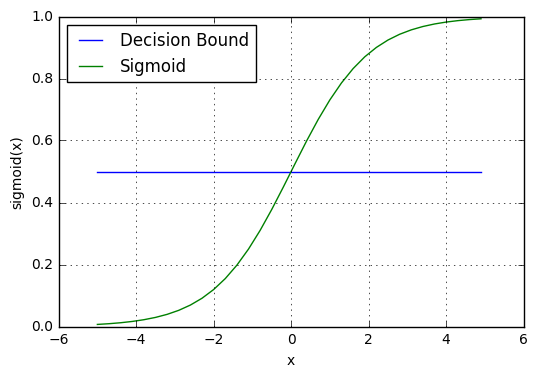
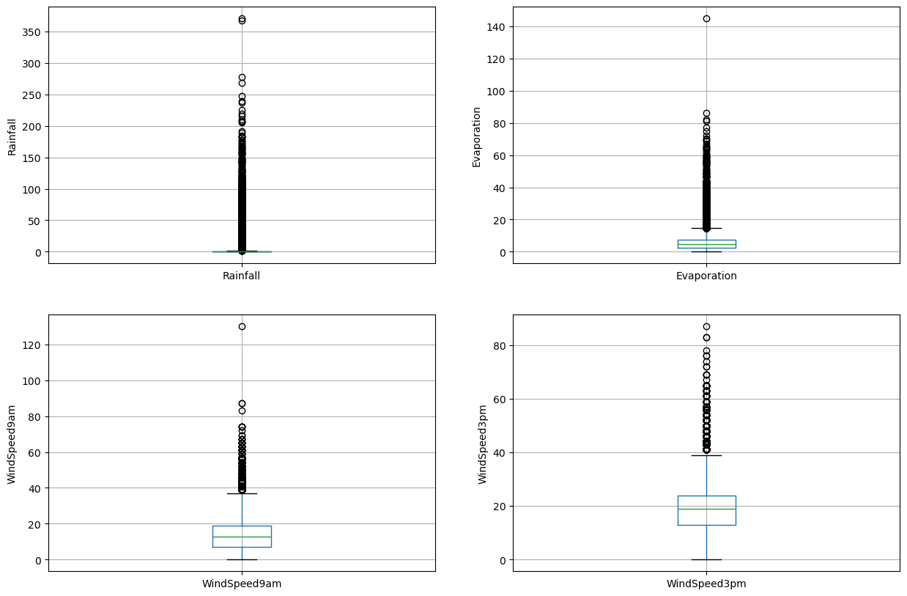
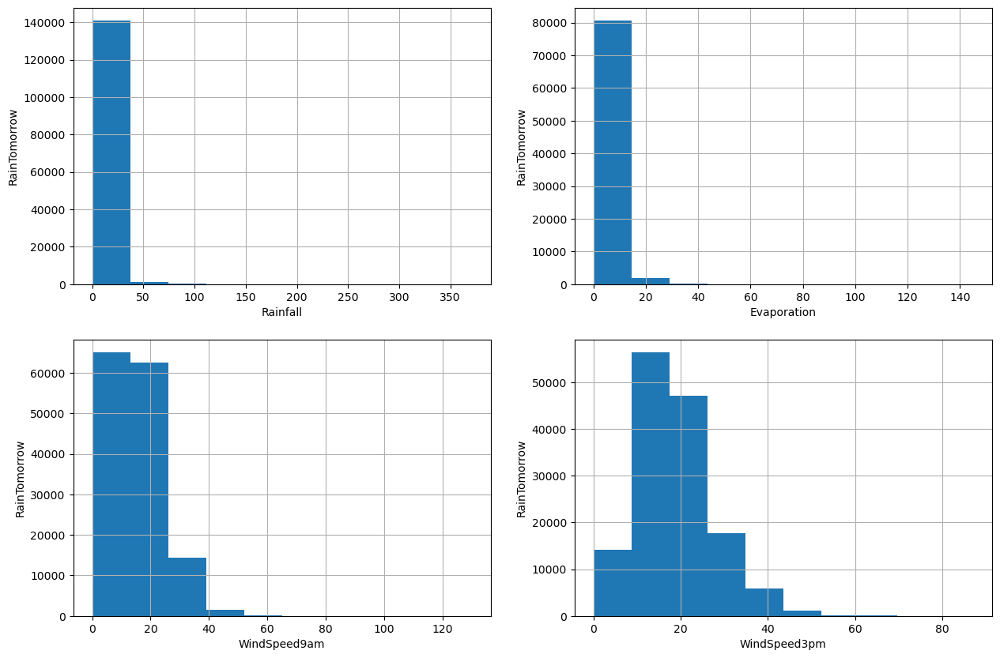
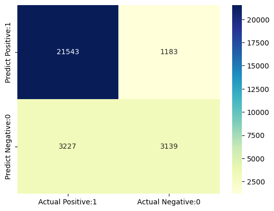
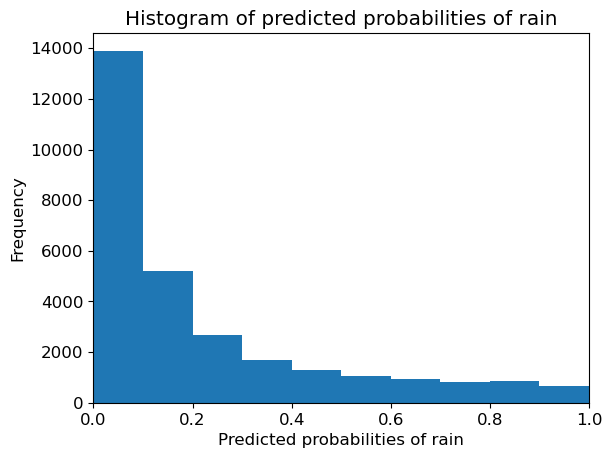

Python과 Scikit-Learn으로 Logistic Regression을 구현한다
내일 호주에 비가 올지 여부를 예측하기 위해 로지스틱 회귀 분류기를 구축하고
로지스틱 회귀를 사용하여 이진 분류 모델을 교육한다

# 1. 로지스틱 회귀 소개

데이터 과학자가 새로운 분류 문제를 접할 때 가장 먼저 떠오를 수 있는 알고리즘은 로지스틱 회귀입니다. 이산 클래스 집합에 대한 관찰을 예측하는 데 사용되는 지도 학습 분류 알고리즘입니다. 실제로 관측치를 여러 범주로 분류하는 데 사용됩니다. 


따라서 출력은 본질적으로 이산적입니다. 로지스틱 회귀는 로짓 회귀라고도 합니다. 
분류 문제를 해결하는 데 사용되는 가장 간단하고 직관적이며 다양한 분류 알고리즘 중 하나입니다.

# 2. 로지스틱 회귀 직관

통계에서 로지스틱 회귀 모델은 주로 분류 목적으로 사용되는 널리 사용되는 통계 모델입니다. 이는 일련의 관찰이 주어지면 로지스틱 회귀 알고리즘이 이러한 관찰을 두 개 이상의 이산 클래스로 분류하는 데 도움이 된다는 것을 의미합니다. 
따라서 대상 변수는 본질적으로 이산적입니다.

로지스틱 회귀 알고리즘은 다음과 같이 작동합니다.

### 선형 방정식 구현

로지스틱 회귀 알고리즘은 응답 값을 예측하기 위해 독립 또는 설명 변수가 있는 선형 방정식을 구현하여 작동.

예를 들어 공부한 시간과 시험에 합격할 확률의 예를 고려합니다. 여기서 학습시간은 설명변수로 x1로 표시한다. 시험에 합격할 확률은 응답 또는 목표 변수이며 z로 표시됩니다.

하나의 설명 변수(x1)와 하나의 응답 변수(z)가 있는 경우 선형 방정식은 수학적으로 다음 방정식으로 주어집니다.

z = β0 + β1x1  

여기서 계수 β0 및 β1은 모델의 매개변수입니다.


설명 변수가 여러 개인 경우 위의 방정식은 다음과 같이 확장될 수 있습니다.

z = β0 + β1x1+ β2x2+……..+ βnxn

여기서 계수 β0, β1, β2 및 βn은 모델의 매개변수입니다.


따라서 예측 응답 값은 위의 방정식으로 주어지며 z로 표시됩니다.

### Sigmoid 함수

z로 표시된 이 예측 응답 값은 0과 1 사이의 확률 값으로 변환됩니다. 예측 값을 확률 값에 매핑하기 위해 시그모이드 함수를 사용합니다. 그런 다음 이 시그모이드 함수는 모든 실제 값을 0과 1 사이의 확률 값으로 매핑합니다.


기계 학습에서 시그모이드 함수는 예측을 확률에 매핑하는 데 사용됩니다. 시그모이드 함수는 S자 모양의 곡선을 가집니다. 시그모이드 곡선이라고도 합니다.


Sigmoid 함수는 Logistic 함수의 특별한 경우입니다. 다음 수학 공식으로 제공됩니다.

그래픽으로 시그모이드 함수를 다음 그래프로 나타낼 수 있습니다.


```python
!pip install IPython 
from IPython.display import Image
```

    Requirement already satisfied: IPython in c:\users\hara0\anaconda3\lib\site-packages (8.10.0)
    Requirement already satisfied: stack-data in c:\users\hara0\anaconda3\lib\site-packages (from IPython) (0.2.0)
    Requirement already satisfied: traitlets>=5 in c:\users\hara0\anaconda3\lib\site-packages (from IPython) (5.7.1)
    Requirement already satisfied: colorama in c:\users\hara0\anaconda3\lib\site-packages (from IPython) (0.4.6)
    Requirement already satisfied: prompt-toolkit<3.1.0,>=3.0.30 in c:\users\hara0\anaconda3\lib\site-packages (from IPython) (3.0.36)
    Requirement already satisfied: pickleshare in c:\users\hara0\anaconda3\lib\site-packages (from IPython) (0.7.5)
    Requirement already satisfied: pygments>=2.4.0 in c:\users\hara0\anaconda3\lib\site-packages (from IPython) (2.11.2)
    Requirement already satisfied: matplotlib-inline in c:\users\hara0\anaconda3\lib\site-packages (from IPython) (0.1.6)
    Requirement already satisfied: backcall in c:\users\hara0\anaconda3\lib\site-packages (from IPython) (0.2.0)
    Requirement already satisfied: jedi>=0.16 in c:\users\hara0\anaconda3\lib\site-packages (from IPython) (0.18.1)
    Requirement already satisfied: decorator in c:\users\hara0\anaconda3\lib\site-packages (from IPython) (5.1.1)
    Requirement already satisfied: parso<0.9.0,>=0.8.0 in c:\users\hara0\anaconda3\lib\site-packages (from jedi>=0.16->IPython) (0.8.3)
    Requirement already satisfied: wcwidth in c:\users\hara0\anaconda3\lib\site-packages (from prompt-toolkit<3.1.0,>=3.0.30->IPython) (0.2.5)
    Requirement already satisfied: executing in c:\users\hara0\anaconda3\lib\site-packages (from stack-data->IPython) (0.8.3)
    Requirement already satisfied: asttokens in c:\users\hara0\anaconda3\lib\site-packages (from stack-data->IPython) (2.0.5)
    Requirement already satisfied: pure-eval in c:\users\hara0\anaconda3\lib\site-packages (from stack-data->IPython) (0.2.2)
    Requirement already satisfied: six in c:\users\hara0\anaconda3\lib\site-packages (from asttokens->stack-data->IPython) (1.16.0)
    


```python
Image("image1.png")
```


    

    


### 결정 경계

시그모이드 함수는 0과 1 사이의 확률 값을 반환합니다. 그런 다음 이 확률 값은 "0" 또는 "1"인 개별 클래스에 매핑됩니다.

이 확률 값을 불연속 클래스(합격/불합격, 예/아니오, 참/거짓)에 매핑하기 위해 임계값을 선택합니다. 이 임계값을 결정 경계라고 합니다. 이 임계값 이상에서는 확률 값을 클래스 1에 매핑하고 그 아래에서는 값을 클래스 0에 매핑합니다

수학적으로 다음과 같이 표현할 수 있습니다.

p ≥ 0.5 => class = 1

p < 0.5 => class = 0

일반적으로 결정 경계는 0.5로 설정됩니다. 따라서 확률 값이 0.8(> 0.5)이면 이 관찰을 클래스 1에 매핑합니다. 마찬가지로 확률 값이 0.2(< 0.5)이면 이 관찰을 클래스 0에 매핑합니다. 


```python
Image("image2.png")
```


    

    


### 예측하기

이제 우리는 로지스틱 회귀에서 시그모이드 함수와 결정 경계에 대해 알게 되었습니다.

시그모이드 함수와 결정 경계에 대한 지식을 사용하여 예측 함수를 작성할 수 있습니다. 로지스틱 회귀의 예측 함수는 관찰이 긍정적일 확률(예 또는 참)을 반환합니다. 

이것을 클래스 1이라고 하고 P(클래스 = 1)로 표시합니다. 

확률이 1에 가까우면 관찰이 클래스 1에 있고 그렇지 않으면 클래스 0이라는 모델에 대해 더 확신할 수 있습니다.

# 3. 로지스틱 회귀의 가정

로지스틱 회귀 모델에는 몇 가지 주요 가정이 필요

1. 로지스틱 회귀 모델에서는 종속 변수가 본질적으로 이진, 다항 또는 순서여야 한다.

2. 관찰이 서로 독립적이어야 합니다. 따라서 관찰은 반복 측정에서 나오지 않아야 한다.

3. 로지스틱 회귀 알고리즘은 독립 변수 간에 다중 공선성이 거의 또는 전혀 필요하지 않다. 이는 독립 변수가 서로 너무 높은 상관관계를 가지지 않아야 함을 의미한다.

4. 로지스틱 회귀 모델은 독립 변수의 선형성과 로그 확률을 가정한다.

5. 로지스틱 회귀 모델의 성공 여부는 샘플 크기에 따라 다르다. 일반적으로 높은 정확도를 달성하려면 큰 샘플 크기가 필요


# 4. 로지스틱 회귀의 유형

로지스틱 회귀 모델은 대상 변수 범주에 따라 세 그룹으로 분류할 수 있습니다. 

#### 1. 이진 로지스틱 회귀

이진 로지스틱 회귀에서 대상 변수에는 두 가지 가능한 범주가 있습니다. 카테고리의 일반적인 예는 예 또는 아니오, 좋음 또는 나쁨, 참 또는 거짓, 스팸 또는 스팸 없음, 합격 또는 불합격입니다.

#### 2. 다항 로지스틱 회귀

다항 로지스틱 회귀에서 대상 변수에는 특정 순서가 아닌 세 개 이상의 범주가 있습니다. 따라서 세 개 이상의 명목 범주가 있습니다. 예에는 사과, 망고, 오렌지 및 바나나와 같은 과일 범주 유형이 포함됩니다.

#### 3. 서수 로지스틱 회귀
순서형 로지스틱 회귀분석에서 대상 변수에는 세 개 이상의 순서 범주가 있습니다. 따라서 범주와 관련된 고유한 순서가 있습니다. 예를 들어, 학생의 성과는 나쁨, 보통, 양호 및 우수로 분류할 수 있습니다


# 5. 라이브러리 가져오기


```python
import numpy as np 
import pandas as pd # 데이터 처리, CSV 파일 I/O(예: pd.read_csv)
import matplotlib.pyplot as plt # 데이터 시각화
import seaborn as sns # 통계 데이터 시각화
%matplotlib inline

# 입력 데이터 파일은 "../input/" 디렉토리에서 사용할 수 있음
# 예를 들어 이것을 실행하면(실행을 클릭하거나 Shift+Enter를 눌러) 입력 디렉토리 아래의 모든 파일이 나열됨

import os
for dirname, _, filenames in os.walk('/kaggle/input'):
    for filename in filenames:
        print(os.path.join(dirname, filename))

# 현재 디렉터리에 쓰는 모든 결과는 출력으로 저장됨.
```


```python
import warnings

warnings.filterwarnings('ignore')
```

# 6. 데이터세트 가져오기


```python
data = 'weatherAUS.csv'

df = pd.read_csv(data)
```

# 7. 탐색적 데이터 분석

이제 데이터에 대한 인사이트를 얻기 위해 데이터를 탐색하겠습니다.


```python
# 데이터세트의 차원 보기

df.shape
```


    (145460, 23)


데이터 세트에 142193개의 인스턴스와 24개의 변수가 있음을 알 수 있습니다


```python
# 데이터세트 미리보기

df.head()
```


<div>
<style scoped>
    .dataframe tbody tr th:only-of-type {
        vertical-align: middle;
    }

    .dataframe tbody tr th {
        vertical-align: top;
    }

    .dataframe thead th {
        text-align: right;
    }
</style>
<table border="1" class="dataframe">
  <thead>
    <tr style="text-align: right;">
      <th></th>
      <th>Date</th>
      <th>Location</th>
      <th>MinTemp</th>
      <th>MaxTemp</th>
      <th>Rainfall</th>
      <th>Evaporation</th>
      <th>Sunshine</th>
      <th>WindGustDir</th>
      <th>WindGustSpeed</th>
      <th>WindDir9am</th>
      <th>...</th>
      <th>Humidity9am</th>
      <th>Humidity3pm</th>
      <th>Pressure9am</th>
      <th>Pressure3pm</th>
      <th>Cloud9am</th>
      <th>Cloud3pm</th>
      <th>Temp9am</th>
      <th>Temp3pm</th>
      <th>RainToday</th>
      <th>RainTomorrow</th>
    </tr>
  </thead>
  <tbody>
    <tr>
      <th>0</th>
      <td>2008-12-01</td>
      <td>Albury</td>
      <td>13.4</td>
      <td>22.9</td>
      <td>0.6</td>
      <td>NaN</td>
      <td>NaN</td>
      <td>W</td>
      <td>44.0</td>
      <td>W</td>
      <td>...</td>
      <td>71.0</td>
      <td>22.0</td>
      <td>1007.7</td>
      <td>1007.1</td>
      <td>8.0</td>
      <td>NaN</td>
      <td>16.9</td>
      <td>21.8</td>
      <td>No</td>
      <td>No</td>
    </tr>
    <tr>
      <th>1</th>
      <td>2008-12-02</td>
      <td>Albury</td>
      <td>7.4</td>
      <td>25.1</td>
      <td>0.0</td>
      <td>NaN</td>
      <td>NaN</td>
      <td>WNW</td>
      <td>44.0</td>
      <td>NNW</td>
      <td>...</td>
      <td>44.0</td>
      <td>25.0</td>
      <td>1010.6</td>
      <td>1007.8</td>
      <td>NaN</td>
      <td>NaN</td>
      <td>17.2</td>
      <td>24.3</td>
      <td>No</td>
      <td>No</td>
    </tr>
    <tr>
      <th>2</th>
      <td>2008-12-03</td>
      <td>Albury</td>
      <td>12.9</td>
      <td>25.7</td>
      <td>0.0</td>
      <td>NaN</td>
      <td>NaN</td>
      <td>WSW</td>
      <td>46.0</td>
      <td>W</td>
      <td>...</td>
      <td>38.0</td>
      <td>30.0</td>
      <td>1007.6</td>
      <td>1008.7</td>
      <td>NaN</td>
      <td>2.0</td>
      <td>21.0</td>
      <td>23.2</td>
      <td>No</td>
      <td>No</td>
    </tr>
    <tr>
      <th>3</th>
      <td>2008-12-04</td>
      <td>Albury</td>
      <td>9.2</td>
      <td>28.0</td>
      <td>0.0</td>
      <td>NaN</td>
      <td>NaN</td>
      <td>NE</td>
      <td>24.0</td>
      <td>SE</td>
      <td>...</td>
      <td>45.0</td>
      <td>16.0</td>
      <td>1017.6</td>
      <td>1012.8</td>
      <td>NaN</td>
      <td>NaN</td>
      <td>18.1</td>
      <td>26.5</td>
      <td>No</td>
      <td>No</td>
    </tr>
    <tr>
      <th>4</th>
      <td>2008-12-05</td>
      <td>Albury</td>
      <td>17.5</td>
      <td>32.3</td>
      <td>1.0</td>
      <td>NaN</td>
      <td>NaN</td>
      <td>W</td>
      <td>41.0</td>
      <td>ENE</td>
      <td>...</td>
      <td>82.0</td>
      <td>33.0</td>
      <td>1010.8</td>
      <td>1006.0</td>
      <td>7.0</td>
      <td>8.0</td>
      <td>17.8</td>
      <td>29.7</td>
      <td>No</td>
      <td>No</td>
    </tr>
  </tbody>
</table>
<p>5 rows × 23 columns</p>
</div>


```python
col_names = df.columns

col_names
```


    Index(['Date', 'Location', 'MinTemp', 'MaxTemp', 'Rainfall', 'Evaporation',
           'Sunshine', 'WindGustDir', 'WindGustSpeed', 'WindDir9am', 'WindDir3pm',
           'WindSpeed9am', 'WindSpeed3pm', 'Humidity9am', 'Humidity3pm',
           'Pressure9am', 'Pressure3pm', 'Cloud9am', 'Cloud3pm', 'Temp9am',
           'Temp3pm', 'RainToday', 'RainTomorrow'],
          dtype='object')


```python
# 데이터 세트 요약 보기

df.info()
```

    <class 'pandas.core.frame.DataFrame'>
    RangeIndex: 145460 entries, 0 to 145459
    Data columns (total 23 columns):
     #   Column         Non-Null Count   Dtype  
    ---  ------         --------------   -----  
     0   Date           145460 non-null  object 
     1   Location       145460 non-null  object 
     2   MinTemp        143975 non-null  float64
     3   MaxTemp        144199 non-null  float64
     4   Rainfall       142199 non-null  float64
     5   Evaporation    82670 non-null   float64
     6   Sunshine       75625 non-null   float64
     7   WindGustDir    135134 non-null  object 
     8   WindGustSpeed  135197 non-null  float64
     9   WindDir9am     134894 non-null  object 
     10  WindDir3pm     141232 non-null  object 
     11  WindSpeed9am   143693 non-null  float64
     12  WindSpeed3pm   142398 non-null  float64
     13  Humidity9am    142806 non-null  float64
     14  Humidity3pm    140953 non-null  float64
     15  Pressure9am    130395 non-null  float64
     16  Pressure3pm    130432 non-null  float64
     17  Cloud9am       89572 non-null   float64
     18  Cloud3pm       86102 non-null   float64
     19  Temp9am        143693 non-null  float64
     20  Temp3pm        141851 non-null  float64
     21  RainToday      142199 non-null  object 
     22  RainTomorrow   142193 non-null  object 
    dtypes: float64(16), object(7)
    memory usage: 25.5+ MB
    

#### 변수의 종류

이 섹션에서는 데이터 세트를 범주형 변수와 숫자 변수로 분리합니다. 데이터 세트에는 범주형 변수와 숫자 변수가 혼합되어 있습니다. 범주형 변수에는 개체 데이터 유형이 있습니다. 숫자 변수의 데이터 유형은 float64입니다.

우선 범주형 변수를 찾을 것입니다.


```python
# 범주형 변수 찾기

categorical = [var for var in df.columns if df[var].dtype=='O']

print('There are {} categorical variables\n'.format(len(categorical)))

print('The categorical variables are :', categorical)
```

    There are 7 categorical variables
    
    The categorical variables are : ['Date', 'Location', 'WindGustDir', 'WindDir9am', 'WindDir3pm', 'RainToday', 'RainTomorrow']
    


```python
# 범주형 변수 보기

df[categorical].head()
```


<div>
<style scoped>
    .dataframe tbody tr th:only-of-type {
        vertical-align: middle;
    }

    .dataframe tbody tr th {
        vertical-align: top;
    }

    .dataframe thead th {
        text-align: right;
    }
</style>
<table border="1" class="dataframe">
  <thead>
    <tr style="text-align: right;">
      <th></th>
      <th>Date</th>
      <th>Location</th>
      <th>WindGustDir</th>
      <th>WindDir9am</th>
      <th>WindDir3pm</th>
      <th>RainToday</th>
      <th>RainTomorrow</th>
    </tr>
  </thead>
  <tbody>
    <tr>
      <th>0</th>
      <td>2008-12-01</td>
      <td>Albury</td>
      <td>W</td>
      <td>W</td>
      <td>WNW</td>
      <td>No</td>
      <td>No</td>
    </tr>
    <tr>
      <th>1</th>
      <td>2008-12-02</td>
      <td>Albury</td>
      <td>WNW</td>
      <td>NNW</td>
      <td>WSW</td>
      <td>No</td>
      <td>No</td>
    </tr>
    <tr>
      <th>2</th>
      <td>2008-12-03</td>
      <td>Albury</td>
      <td>WSW</td>
      <td>W</td>
      <td>WSW</td>
      <td>No</td>
      <td>No</td>
    </tr>
    <tr>
      <th>3</th>
      <td>2008-12-04</td>
      <td>Albury</td>
      <td>NE</td>
      <td>SE</td>
      <td>E</td>
      <td>No</td>
      <td>No</td>
    </tr>
    <tr>
      <th>4</th>
      <td>2008-12-05</td>
      <td>Albury</td>
      <td>W</td>
      <td>ENE</td>
      <td>NW</td>
      <td>No</td>
      <td>No</td>
    </tr>
  </tbody>
</table>
</div>


#### 범주형 변수 요약

* 날짜 변수가 있습니다. 날짜 열로 표시됩니다.
* 6개의 범주형 변수가 있습니다. 이들은 Location, WindGustDir, WindDir9am, WindDir3pm, RainToday 및 RainTomorrow에 의해 제공됩니다.
* RainToday와 RainTomorrow라는 두 개의 이진 범주형 변수가 있습니다.
* RainTomorrow는 대상 변수입니다.

### 범주형 변수 내에서 문제 탐색

먼저 범주형 변수를 살펴보겠습니다.


#### 범주형 변수의 결측값


```python
# 범주형 변수에서 누락된 값 확인
df[categorical].isnull().sum()
```


    Date                0
    Location            0
    WindGustDir     10326
    WindDir9am      10566
    WindDir3pm       4228
    RainToday        3261
    RainTomorrow     3267
    dtype: int64


```python
# 누락된 값을 포함하는 범주형 변수 인쇄

cat1 = [var for var in categorical if df[var].isnull().sum()!=0]

print(df[cat1].isnull().sum())
```

    WindGustDir     10326
    WindDir9am      10566
    WindDir3pm       4228
    RainToday        3261
    RainTomorrow     3267
    dtype: int64
    

누락된 값이 포함된 데이터 세트에는 4개의 범주형 변수만 있음을 알 수 있습니다. 

이들은 WindGustDir, WindDir9am, WindDir3pm 및 RainToday입니다.


#### 범주형 변수의 빈도수

이제 범주형 변수의 빈도 수를 확인하겠습니다.


```python
# 범주형 변수의 빈도 보기

for var in categorical: 
    
    print(df[var].value_counts())
```

    2013-11-12    49
    2014-09-01    49
    2014-08-23    49
    2014-08-24    49
    2014-08-25    49
                  ..
    2007-11-29     1
    2007-11-28     1
    2007-11-27     1
    2007-11-26     1
    2008-01-31     1
    Name: Date, Length: 3436, dtype: int64
    Canberra            3436
    Sydney              3344
    Darwin              3193
    Melbourne           3193
    Brisbane            3193
    Adelaide            3193
    Perth               3193
    Hobart              3193
    Albany              3040
    MountGambier        3040
    Ballarat            3040
    Townsville          3040
    GoldCoast           3040
    Cairns              3040
    Launceston          3040
    AliceSprings        3040
    Bendigo             3040
    Albury              3040
    MountGinini         3040
    Wollongong          3040
    Newcastle           3039
    Tuggeranong         3039
    Penrith             3039
    Woomera             3009
    Nuriootpa           3009
    Cobar               3009
    CoffsHarbour        3009
    Moree               3009
    Sale                3009
    PerthAirport        3009
    PearceRAAF          3009
    Witchcliffe         3009
    BadgerysCreek       3009
    Mildura             3009
    NorfolkIsland       3009
    MelbourneAirport    3009
    Richmond            3009
    SydneyAirport       3009
    WaggaWagga          3009
    Williamtown         3009
    Dartmoor            3009
    Watsonia            3009
    Portland            3009
    Walpole             3006
    NorahHead           3004
    SalmonGums          3001
    Katherine           1578
    Nhil                1578
    Uluru               1578
    Name: Location, dtype: int64
    W      9915
    SE     9418
    N      9313
    SSE    9216
    E      9181
    S      9168
    WSW    9069
    SW     8967
    SSW    8736
    WNW    8252
    NW     8122
    ENE    8104
    ESE    7372
    NE     7133
    NNW    6620
    NNE    6548
    Name: WindGustDir, dtype: int64
    N      11758
    SE      9287
    E       9176
    SSE     9112
    NW      8749
    S       8659
    W       8459
    SW      8423
    NNE     8129
    NNW     7980
    ENE     7836
    NE      7671
    ESE     7630
    SSW     7587
    WNW     7414
    WSW     7024
    Name: WindDir9am, dtype: int64
    SE     10838
    W      10110
    S       9926
    WSW     9518
    SSE     9399
    SW      9354
    N       8890
    WNW     8874
    NW      8610
    ESE     8505
    E       8472
    NE      8263
    SSW     8156
    NNW     7870
    ENE     7857
    NNE     6590
    Name: WindDir3pm, dtype: int64
    No     110319
    Yes     31880
    Name: RainToday, dtype: int64
    No     110316
    Yes     31877
    Name: RainTomorrow, dtype: int64
    

#### 레이블 수: 카디널리티

범주형 변수 내의 레이블 수를 카디널리티라고 합니다. 

변수 내의 레이블 수가 많은 것을 높은 카디널리티라고 합니다. 
높은 카디널리티는 기계 학습 모델에서 몇 가지 심각한 문제를 일으킬 수 있습니다. 따라서 높은 카디널리티를 확인하겠습니다.


```python
# 범주형 변수의 카디널리티 확인

for var in categorical:
    
    print(var, ' contains ', len(df[var].unique()), ' labels')
```

    Date  contains  3436  labels
    Location  contains  49  labels
    WindGustDir  contains  17  labels
    WindDir9am  contains  17  labels
    WindDir3pm  contains  17  labels
    RainToday  contains  3  labels
    RainTomorrow  contains  3  labels
    

전처리가 필요한 날짜 변수가 있음을 알 수 있습니다. 다음 섹션에서 전처리를 수행합니다.

다른 모든 변수는 상대적으로 적은 수의 변수를 포함합니다.

#### 날짜 변수의 기능 엔지니어링


```python
df['Date'].dtypes
```


    dtype('O')


Date 변수의 데이터 타입이 객체임을 알 수 있습니다. 현재 개체로 코딩된 날짜를 datetime 형식으로 구문 분석하겠습니다.


```python
# 현재 문자열로 코딩된 날짜를 datetime 형식으로 구문 분석합니다.

df['Date'] = pd.to_datetime(df['Date'])
```


```python
# 날짜에서 연도 추출

df['Year'] = df['Date'].dt.year

df['Year'].head()
```


    0    2008
    1    2008
    2    2008
    3    2008
    4    2008
    Name: Year, dtype: int64


```python
# 날짜에서 월 추출

df['Month'] = df['Date'].dt.month

df['Month'].head()
```


    0    12
    1    12
    2    12
    3    12
    4    12
    Name: Month, dtype: int64


```python
# 날짜에서 날짜 추출

df['Day'] = df['Date'].dt.day

df['Day'].head()
```


    0    1
    1    2
    2    3
    3    4
    4    5
    Name: Day, dtype: int64


```python
# 다시 데이터 세트 요약 보기

df.info()
```

    <class 'pandas.core.frame.DataFrame'>
    RangeIndex: 145460 entries, 0 to 145459
    Data columns (total 26 columns):
     #   Column         Non-Null Count   Dtype         
    ---  ------         --------------   -----         
     0   Date           145460 non-null  datetime64[ns]
     1   Location       145460 non-null  object        
     2   MinTemp        143975 non-null  float64       
     3   MaxTemp        144199 non-null  float64       
     4   Rainfall       142199 non-null  float64       
     5   Evaporation    82670 non-null   float64       
     6   Sunshine       75625 non-null   float64       
     7   WindGustDir    135134 non-null  object        
     8   WindGustSpeed  135197 non-null  float64       
     9   WindDir9am     134894 non-null  object        
     10  WindDir3pm     141232 non-null  object        
     11  WindSpeed9am   143693 non-null  float64       
     12  WindSpeed3pm   142398 non-null  float64       
     13  Humidity9am    142806 non-null  float64       
     14  Humidity3pm    140953 non-null  float64       
     15  Pressure9am    130395 non-null  float64       
     16  Pressure3pm    130432 non-null  float64       
     17  Cloud9am       89572 non-null   float64       
     18  Cloud3pm       86102 non-null   float64       
     19  Temp9am        143693 non-null  float64       
     20  Temp3pm        141851 non-null  float64       
     21  RainToday      142199 non-null  object        
     22  RainTomorrow   142193 non-null  object        
     23  Year           145460 non-null  int64         
     24  Month          145460 non-null  int64         
     25  Day            145460 non-null  int64         
    dtypes: datetime64[ns](1), float64(16), int64(3), object(6)
    memory usage: 28.9+ MB
    

Date 변수에서 세 개의 추가 열이 생성된 것을 볼 수 있습니다. 이제 데이터 세트에서 원래 날짜 변수를 삭제합니다.


```python
# 원래 날짜 변수를 삭제합니다.

df.drop('Date', axis=1, inplace = True)
```


```python
# 데이터셋을 다시 미리보기

df.head()
```


<div>
<style scoped>
    .dataframe tbody tr th:only-of-type {
        vertical-align: middle;
    }

    .dataframe tbody tr th {
        vertical-align: top;
    }

    .dataframe thead th {
        text-align: right;
    }
</style>
<table border="1" class="dataframe">
  <thead>
    <tr style="text-align: right;">
      <th></th>
      <th>Location</th>
      <th>MinTemp</th>
      <th>MaxTemp</th>
      <th>Rainfall</th>
      <th>Evaporation</th>
      <th>Sunshine</th>
      <th>WindGustDir</th>
      <th>WindGustSpeed</th>
      <th>WindDir9am</th>
      <th>WindDir3pm</th>
      <th>...</th>
      <th>Pressure3pm</th>
      <th>Cloud9am</th>
      <th>Cloud3pm</th>
      <th>Temp9am</th>
      <th>Temp3pm</th>
      <th>RainToday</th>
      <th>RainTomorrow</th>
      <th>Year</th>
      <th>Month</th>
      <th>Day</th>
    </tr>
  </thead>
  <tbody>
    <tr>
      <th>0</th>
      <td>Albury</td>
      <td>13.4</td>
      <td>22.9</td>
      <td>0.6</td>
      <td>NaN</td>
      <td>NaN</td>
      <td>W</td>
      <td>44.0</td>
      <td>W</td>
      <td>WNW</td>
      <td>...</td>
      <td>1007.1</td>
      <td>8.0</td>
      <td>NaN</td>
      <td>16.9</td>
      <td>21.8</td>
      <td>No</td>
      <td>No</td>
      <td>2008</td>
      <td>12</td>
      <td>1</td>
    </tr>
    <tr>
      <th>1</th>
      <td>Albury</td>
      <td>7.4</td>
      <td>25.1</td>
      <td>0.0</td>
      <td>NaN</td>
      <td>NaN</td>
      <td>WNW</td>
      <td>44.0</td>
      <td>NNW</td>
      <td>WSW</td>
      <td>...</td>
      <td>1007.8</td>
      <td>NaN</td>
      <td>NaN</td>
      <td>17.2</td>
      <td>24.3</td>
      <td>No</td>
      <td>No</td>
      <td>2008</td>
      <td>12</td>
      <td>2</td>
    </tr>
    <tr>
      <th>2</th>
      <td>Albury</td>
      <td>12.9</td>
      <td>25.7</td>
      <td>0.0</td>
      <td>NaN</td>
      <td>NaN</td>
      <td>WSW</td>
      <td>46.0</td>
      <td>W</td>
      <td>WSW</td>
      <td>...</td>
      <td>1008.7</td>
      <td>NaN</td>
      <td>2.0</td>
      <td>21.0</td>
      <td>23.2</td>
      <td>No</td>
      <td>No</td>
      <td>2008</td>
      <td>12</td>
      <td>3</td>
    </tr>
    <tr>
      <th>3</th>
      <td>Albury</td>
      <td>9.2</td>
      <td>28.0</td>
      <td>0.0</td>
      <td>NaN</td>
      <td>NaN</td>
      <td>NE</td>
      <td>24.0</td>
      <td>SE</td>
      <td>E</td>
      <td>...</td>
      <td>1012.8</td>
      <td>NaN</td>
      <td>NaN</td>
      <td>18.1</td>
      <td>26.5</td>
      <td>No</td>
      <td>No</td>
      <td>2008</td>
      <td>12</td>
      <td>4</td>
    </tr>
    <tr>
      <th>4</th>
      <td>Albury</td>
      <td>17.5</td>
      <td>32.3</td>
      <td>1.0</td>
      <td>NaN</td>
      <td>NaN</td>
      <td>W</td>
      <td>41.0</td>
      <td>ENE</td>
      <td>NW</td>
      <td>...</td>
      <td>1006.0</td>
      <td>7.0</td>
      <td>8.0</td>
      <td>17.8</td>
      <td>29.7</td>
      <td>No</td>
      <td>No</td>
      <td>2008</td>
      <td>12</td>
      <td>5</td>
    </tr>
  </tbody>
</table>
<p>5 rows × 25 columns</p>
</div>


이제 날짜 변수가 데이터 세트에서 제거된 것을 볼 수 있습니다.

#### 범주형 변수 살펴보기


```python
# 범주형 변수 찾기

categorical = [var for var in df.columns if df[var].dtype=='O']

print('There are {} categorical variables\n'.format(len(categorical)))

print('The categorical variables are :', categorical)
```

    There are 6 categorical variables
    
    The categorical variables are : ['Location', 'WindGustDir', 'WindDir9am', 'WindDir3pm', 'RainToday', 'RainTomorrow']
    

데이터 세트에 6개의 범주형 변수가 있음을 알 수 있습니다. 

날짜 변수가 제거되었습니다. 먼저 범주형 변수에서 누락된 값을 확인하겠습니다.


```python
# 범주형 변수의 결측값 확인

df[categorical].isnull().sum()
```


    Location            0
    WindGustDir     10326
    WindDir9am      10566
    WindDir3pm       4228
    RainToday        3261
    RainTomorrow     3267
    dtype: int64


WindGustDir, WindDir9am, WindDir3pm, RainToday 변수에 누락된 값이 포함되어 있음을 알 수 있습니다. 이러한 변수를 하나씩 살펴보겠습니다.

#### 위치 변수 살펴보기


```python
# Location 변수의 레이블 수를 출력

print('Location contains', len(df.Location.unique()), 'labels')
```

    Location contains 49 labels
    


```python
# 위치변수의 라벨 확인

df.Location.unique()
```


    array(['Albury', 'BadgerysCreek', 'Cobar', 'CoffsHarbour', 'Moree',
           'Newcastle', 'NorahHead', 'NorfolkIsland', 'Penrith', 'Richmond',
           'Sydney', 'SydneyAirport', 'WaggaWagga', 'Williamtown',
           'Wollongong', 'Canberra', 'Tuggeranong', 'MountGinini', 'Ballarat',
           'Bendigo', 'Sale', 'MelbourneAirport', 'Melbourne', 'Mildura',
           'Nhil', 'Portland', 'Watsonia', 'Dartmoor', 'Brisbane', 'Cairns',
           'GoldCoast', 'Townsville', 'Adelaide', 'MountGambier', 'Nuriootpa',
           'Woomera', 'Albany', 'Witchcliffe', 'PearceRAAF', 'PerthAirport',
           'Perth', 'SalmonGums', 'Walpole', 'Hobart', 'Launceston',
           'AliceSprings', 'Darwin', 'Katherine', 'Uluru'], dtype=object)


```python
# 위치 변수 값의 빈도 분포 확인

df.Location.value_counts()
```


    Canberra            3436
    Sydney              3344
    Darwin              3193
    Melbourne           3193
    Brisbane            3193
    Adelaide            3193
    Perth               3193
    Hobart              3193
    Albany              3040
    MountGambier        3040
    Ballarat            3040
    Townsville          3040
    GoldCoast           3040
    Cairns              3040
    Launceston          3040
    AliceSprings        3040
    Bendigo             3040
    Albury              3040
    MountGinini         3040
    Wollongong          3040
    Newcastle           3039
    Tuggeranong         3039
    Penrith             3039
    Woomera             3009
    Nuriootpa           3009
    Cobar               3009
    CoffsHarbour        3009
    Moree               3009
    Sale                3009
    PerthAirport        3009
    PearceRAAF          3009
    Witchcliffe         3009
    BadgerysCreek       3009
    Mildura             3009
    NorfolkIsland       3009
    MelbourneAirport    3009
    Richmond            3009
    SydneyAirport       3009
    WaggaWagga          3009
    Williamtown         3009
    Dartmoor            3009
    Watsonia            3009
    Portland            3009
    Walpole             3006
    NorahHead           3004
    SalmonGums          3001
    Katherine           1578
    Nhil                1578
    Uluru               1578
    Name: Location, dtype: int64


```python
# Location 변수의 One Hot Encoding을 해보자
# One Hot Encoding 후 k-1 dummy 변수 가져오기
# head() 메소드로 데이터셋 미리보기

pd.get_dummies(df.Location, drop_first=True).head()
```


<div>
<style scoped>
    .dataframe tbody tr th:only-of-type {
        vertical-align: middle;
    }

    .dataframe tbody tr th {
        vertical-align: top;
    }

    .dataframe thead th {
        text-align: right;
    }
</style>
<table border="1" class="dataframe">
  <thead>
    <tr style="text-align: right;">
      <th></th>
      <th>Albany</th>
      <th>Albury</th>
      <th>AliceSprings</th>
      <th>BadgerysCreek</th>
      <th>Ballarat</th>
      <th>Bendigo</th>
      <th>Brisbane</th>
      <th>Cairns</th>
      <th>Canberra</th>
      <th>Cobar</th>
      <th>...</th>
      <th>Townsville</th>
      <th>Tuggeranong</th>
      <th>Uluru</th>
      <th>WaggaWagga</th>
      <th>Walpole</th>
      <th>Watsonia</th>
      <th>Williamtown</th>
      <th>Witchcliffe</th>
      <th>Wollongong</th>
      <th>Woomera</th>
    </tr>
  </thead>
  <tbody>
    <tr>
      <th>0</th>
      <td>0</td>
      <td>1</td>
      <td>0</td>
      <td>0</td>
      <td>0</td>
      <td>0</td>
      <td>0</td>
      <td>0</td>
      <td>0</td>
      <td>0</td>
      <td>...</td>
      <td>0</td>
      <td>0</td>
      <td>0</td>
      <td>0</td>
      <td>0</td>
      <td>0</td>
      <td>0</td>
      <td>0</td>
      <td>0</td>
      <td>0</td>
    </tr>
    <tr>
      <th>1</th>
      <td>0</td>
      <td>1</td>
      <td>0</td>
      <td>0</td>
      <td>0</td>
      <td>0</td>
      <td>0</td>
      <td>0</td>
      <td>0</td>
      <td>0</td>
      <td>...</td>
      <td>0</td>
      <td>0</td>
      <td>0</td>
      <td>0</td>
      <td>0</td>
      <td>0</td>
      <td>0</td>
      <td>0</td>
      <td>0</td>
      <td>0</td>
    </tr>
    <tr>
      <th>2</th>
      <td>0</td>
      <td>1</td>
      <td>0</td>
      <td>0</td>
      <td>0</td>
      <td>0</td>
      <td>0</td>
      <td>0</td>
      <td>0</td>
      <td>0</td>
      <td>...</td>
      <td>0</td>
      <td>0</td>
      <td>0</td>
      <td>0</td>
      <td>0</td>
      <td>0</td>
      <td>0</td>
      <td>0</td>
      <td>0</td>
      <td>0</td>
    </tr>
    <tr>
      <th>3</th>
      <td>0</td>
      <td>1</td>
      <td>0</td>
      <td>0</td>
      <td>0</td>
      <td>0</td>
      <td>0</td>
      <td>0</td>
      <td>0</td>
      <td>0</td>
      <td>...</td>
      <td>0</td>
      <td>0</td>
      <td>0</td>
      <td>0</td>
      <td>0</td>
      <td>0</td>
      <td>0</td>
      <td>0</td>
      <td>0</td>
      <td>0</td>
    </tr>
    <tr>
      <th>4</th>
      <td>0</td>
      <td>1</td>
      <td>0</td>
      <td>0</td>
      <td>0</td>
      <td>0</td>
      <td>0</td>
      <td>0</td>
      <td>0</td>
      <td>0</td>
      <td>...</td>
      <td>0</td>
      <td>0</td>
      <td>0</td>
      <td>0</td>
      <td>0</td>
      <td>0</td>
      <td>0</td>
      <td>0</td>
      <td>0</td>
      <td>0</td>
    </tr>
  </tbody>
</table>
<p>5 rows × 48 columns</p>
</div>


#### WindGustDir 변수 탐색


```python
# WindGustDir 변수의 라벨 수 출력

print('WindGustDir contains', len(df['WindGustDir'].unique()), 'labels')
```

    WindGustDir contains 17 labels
    


```python
# WindGustDir 변수의 레이블 확인

df['WindGustDir'].unique()
```


    array(['W', 'WNW', 'WSW', 'NE', 'NNW', 'N', 'NNE', 'SW', nan, 'ENE',
           'SSE', 'S', 'NW', 'SE', 'ESE', 'E', 'SSW'], dtype=object)


```python
# WindGustDir 변수 값의 빈도 분포 확인

df.WindGustDir.value_counts()
```


    W      9915
    SE     9418
    N      9313
    SSE    9216
    E      9181
    S      9168
    WSW    9069
    SW     8967
    SSW    8736
    WNW    8252
    NW     8122
    ENE    8104
    ESE    7372
    NE     7133
    NNW    6620
    NNE    6548
    Name: WindGustDir, dtype: int64


```python
# WindGustDir 변수의 One Hot Encoding을 해보자
# One Hot Encoding 후 k-1 dummy 변수 가져오기
# 또한 누락된 데이터가 있음을 나타내기 위해 더미 변수를 추가합니다.
# head() 메소드로 데이터셋 미리보기

pd.get_dummies(df.WindGustDir, drop_first=True, dummy_na=True).head()
```


<div>
<style scoped>
    .dataframe tbody tr th:only-of-type {
        vertical-align: middle;
    }

    .dataframe tbody tr th {
        vertical-align: top;
    }

    .dataframe thead th {
        text-align: right;
    }
</style>
<table border="1" class="dataframe">
  <thead>
    <tr style="text-align: right;">
      <th></th>
      <th>ENE</th>
      <th>ESE</th>
      <th>N</th>
      <th>NE</th>
      <th>NNE</th>
      <th>NNW</th>
      <th>NW</th>
      <th>S</th>
      <th>SE</th>
      <th>SSE</th>
      <th>SSW</th>
      <th>SW</th>
      <th>W</th>
      <th>WNW</th>
      <th>WSW</th>
      <th>NaN</th>
    </tr>
  </thead>
  <tbody>
    <tr>
      <th>0</th>
      <td>0</td>
      <td>0</td>
      <td>0</td>
      <td>0</td>
      <td>0</td>
      <td>0</td>
      <td>0</td>
      <td>0</td>
      <td>0</td>
      <td>0</td>
      <td>0</td>
      <td>0</td>
      <td>1</td>
      <td>0</td>
      <td>0</td>
      <td>0</td>
    </tr>
    <tr>
      <th>1</th>
      <td>0</td>
      <td>0</td>
      <td>0</td>
      <td>0</td>
      <td>0</td>
      <td>0</td>
      <td>0</td>
      <td>0</td>
      <td>0</td>
      <td>0</td>
      <td>0</td>
      <td>0</td>
      <td>0</td>
      <td>1</td>
      <td>0</td>
      <td>0</td>
    </tr>
    <tr>
      <th>2</th>
      <td>0</td>
      <td>0</td>
      <td>0</td>
      <td>0</td>
      <td>0</td>
      <td>0</td>
      <td>0</td>
      <td>0</td>
      <td>0</td>
      <td>0</td>
      <td>0</td>
      <td>0</td>
      <td>0</td>
      <td>0</td>
      <td>1</td>
      <td>0</td>
    </tr>
    <tr>
      <th>3</th>
      <td>0</td>
      <td>0</td>
      <td>0</td>
      <td>1</td>
      <td>0</td>
      <td>0</td>
      <td>0</td>
      <td>0</td>
      <td>0</td>
      <td>0</td>
      <td>0</td>
      <td>0</td>
      <td>0</td>
      <td>0</td>
      <td>0</td>
      <td>0</td>
    </tr>
    <tr>
      <th>4</th>
      <td>0</td>
      <td>0</td>
      <td>0</td>
      <td>0</td>
      <td>0</td>
      <td>0</td>
      <td>0</td>
      <td>0</td>
      <td>0</td>
      <td>0</td>
      <td>0</td>
      <td>0</td>
      <td>1</td>
      <td>0</td>
      <td>0</td>
      <td>0</td>
    </tr>
  </tbody>
</table>
</div>


```python
# 데이터 세트의 행에 대한 부울 변수당 1의 수를 합산합니다.
# 각 범주에 대해 얼마나 많은 관찰이 있는지 알려줍니다.

pd.get_dummies(df.WindGustDir, drop_first=True, dummy_na=True).sum(axis=0)
```


    ENE     8104
    ESE     7372
    N       9313
    NE      7133
    NNE     6548
    NNW     6620
    NW      8122
    S       9168
    SE      9418
    SSE     9216
    SSW     8736
    SW      8967
    W       9915
    WNW     8252
    WSW     9069
    NaN    10326
    dtype: int64


WindGustDir 변수에 10326개의 누락된 값이 있음을 알 수 있습니다.

#### Explore WindDir9am variable


```python
# WindDir9am 변수의 라벨 수 출력

print('WindDir9am contains', len(df['WindDir9am'].unique()), 'labels')
```

    WindDir9am contains 17 labels
    


```python
# WindDir9am 변수의 레이블 확인

df['WindDir9am'].unique()
```


    array(['W', 'NNW', 'SE', 'ENE', 'SW', 'SSE', 'S', 'NE', nan, 'SSW', 'N',
           'WSW', 'ESE', 'E', 'NW', 'WNW', 'NNE'], dtype=object)


```python
# WindDir9am 변수 값의 빈도 분포 확인

df['WindDir9am'].value_counts()
```


    N      11758
    SE      9287
    E       9176
    SSE     9112
    NW      8749
    S       8659
    W       8459
    SW      8423
    NNE     8129
    NNW     7980
    ENE     7836
    NE      7671
    ESE     7630
    SSW     7587
    WNW     7414
    WSW     7024
    Name: WindDir9am, dtype: int64


```python
# WindDir9am 변수의 One Hot Encoding을 해보자
# One Hot Encoding 후 k-1 dummy 변수 가져오기
# 또한 누락된 데이터가 있음을 나타내기 위해 더미 변수를 추가합니다.
# head() 메소드로 데이터셋 미리보기

pd.get_dummies(df.WindDir9am, drop_first=True, dummy_na=True).head()
```


<div>
<style scoped>
    .dataframe tbody tr th:only-of-type {
        vertical-align: middle;
    }

    .dataframe tbody tr th {
        vertical-align: top;
    }

    .dataframe thead th {
        text-align: right;
    }
</style>
<table border="1" class="dataframe">
  <thead>
    <tr style="text-align: right;">
      <th></th>
      <th>ENE</th>
      <th>ESE</th>
      <th>N</th>
      <th>NE</th>
      <th>NNE</th>
      <th>NNW</th>
      <th>NW</th>
      <th>S</th>
      <th>SE</th>
      <th>SSE</th>
      <th>SSW</th>
      <th>SW</th>
      <th>W</th>
      <th>WNW</th>
      <th>WSW</th>
      <th>NaN</th>
    </tr>
  </thead>
  <tbody>
    <tr>
      <th>0</th>
      <td>0</td>
      <td>0</td>
      <td>0</td>
      <td>0</td>
      <td>0</td>
      <td>0</td>
      <td>0</td>
      <td>0</td>
      <td>0</td>
      <td>0</td>
      <td>0</td>
      <td>0</td>
      <td>1</td>
      <td>0</td>
      <td>0</td>
      <td>0</td>
    </tr>
    <tr>
      <th>1</th>
      <td>0</td>
      <td>0</td>
      <td>0</td>
      <td>0</td>
      <td>0</td>
      <td>1</td>
      <td>0</td>
      <td>0</td>
      <td>0</td>
      <td>0</td>
      <td>0</td>
      <td>0</td>
      <td>0</td>
      <td>0</td>
      <td>0</td>
      <td>0</td>
    </tr>
    <tr>
      <th>2</th>
      <td>0</td>
      <td>0</td>
      <td>0</td>
      <td>0</td>
      <td>0</td>
      <td>0</td>
      <td>0</td>
      <td>0</td>
      <td>0</td>
      <td>0</td>
      <td>0</td>
      <td>0</td>
      <td>1</td>
      <td>0</td>
      <td>0</td>
      <td>0</td>
    </tr>
    <tr>
      <th>3</th>
      <td>0</td>
      <td>0</td>
      <td>0</td>
      <td>0</td>
      <td>0</td>
      <td>0</td>
      <td>0</td>
      <td>0</td>
      <td>1</td>
      <td>0</td>
      <td>0</td>
      <td>0</td>
      <td>0</td>
      <td>0</td>
      <td>0</td>
      <td>0</td>
    </tr>
    <tr>
      <th>4</th>
      <td>1</td>
      <td>0</td>
      <td>0</td>
      <td>0</td>
      <td>0</td>
      <td>0</td>
      <td>0</td>
      <td>0</td>
      <td>0</td>
      <td>0</td>
      <td>0</td>
      <td>0</td>
      <td>0</td>
      <td>0</td>
      <td>0</td>
      <td>0</td>
    </tr>
  </tbody>
</table>
</div>


```python
# 데이터 세트의 행에 대한 부울 변수당 1의 수를 합산합니다.
# 각 범주에 대해 얼마나 많은 관찰이 있는지 알려줍니다.

pd.get_dummies(df.WindDir9am, drop_first=True, dummy_na=True).sum(axis=0)
```


    ENE     7836
    ESE     7630
    N      11758
    NE      7671
    NNE     8129
    NNW     7980
    NW      8749
    S       8659
    SE      9287
    SSE     9112
    SSW     7587
    SW      8423
    W       8459
    WNW     7414
    WSW     7024
    NaN    10566
    dtype: int64


WindDir9am 변수에 10566개의 누락된 값이 있음을 알 수 있습니다.

#### WindDir3pm 변수 탐색


```python
print('WindDir3pm contains', len(df['WindDir3pm'].unique()), 'labels')
```

    WindDir3pm contains 17 labels
    


```python
df['WindDir3pm'].unique()
```


    array(['WNW', 'WSW', 'E', 'NW', 'W', 'SSE', 'ESE', 'ENE', 'NNW', 'SSW',
           'SW', 'SE', 'N', 'S', 'NNE', nan, 'NE'], dtype=object)


```python
df['WindDir3pm'].value_counts()
```


    SE     10838
    W      10110
    S       9926
    WSW     9518
    SSE     9399
    SW      9354
    N       8890
    WNW     8874
    NW      8610
    ESE     8505
    E       8472
    NE      8263
    SSW     8156
    NNW     7870
    ENE     7857
    NNE     6590
    Name: WindDir3pm, dtype: int64


```python
pd.get_dummies(df.WindDir3pm, drop_first=True, dummy_na=True).head()
```


<div>
<style scoped>
    .dataframe tbody tr th:only-of-type {
        vertical-align: middle;
    }

    .dataframe tbody tr th {
        vertical-align: top;
    }

    .dataframe thead th {
        text-align: right;
    }
</style>
<table border="1" class="dataframe">
  <thead>
    <tr style="text-align: right;">
      <th></th>
      <th>ENE</th>
      <th>ESE</th>
      <th>N</th>
      <th>NE</th>
      <th>NNE</th>
      <th>NNW</th>
      <th>NW</th>
      <th>S</th>
      <th>SE</th>
      <th>SSE</th>
      <th>SSW</th>
      <th>SW</th>
      <th>W</th>
      <th>WNW</th>
      <th>WSW</th>
      <th>NaN</th>
    </tr>
  </thead>
  <tbody>
    <tr>
      <th>0</th>
      <td>0</td>
      <td>0</td>
      <td>0</td>
      <td>0</td>
      <td>0</td>
      <td>0</td>
      <td>0</td>
      <td>0</td>
      <td>0</td>
      <td>0</td>
      <td>0</td>
      <td>0</td>
      <td>0</td>
      <td>1</td>
      <td>0</td>
      <td>0</td>
    </tr>
    <tr>
      <th>1</th>
      <td>0</td>
      <td>0</td>
      <td>0</td>
      <td>0</td>
      <td>0</td>
      <td>0</td>
      <td>0</td>
      <td>0</td>
      <td>0</td>
      <td>0</td>
      <td>0</td>
      <td>0</td>
      <td>0</td>
      <td>0</td>
      <td>1</td>
      <td>0</td>
    </tr>
    <tr>
      <th>2</th>
      <td>0</td>
      <td>0</td>
      <td>0</td>
      <td>0</td>
      <td>0</td>
      <td>0</td>
      <td>0</td>
      <td>0</td>
      <td>0</td>
      <td>0</td>
      <td>0</td>
      <td>0</td>
      <td>0</td>
      <td>0</td>
      <td>1</td>
      <td>0</td>
    </tr>
    <tr>
      <th>3</th>
      <td>0</td>
      <td>0</td>
      <td>0</td>
      <td>0</td>
      <td>0</td>
      <td>0</td>
      <td>0</td>
      <td>0</td>
      <td>0</td>
      <td>0</td>
      <td>0</td>
      <td>0</td>
      <td>0</td>
      <td>0</td>
      <td>0</td>
      <td>0</td>
    </tr>
    <tr>
      <th>4</th>
      <td>0</td>
      <td>0</td>
      <td>0</td>
      <td>0</td>
      <td>0</td>
      <td>0</td>
      <td>1</td>
      <td>0</td>
      <td>0</td>
      <td>0</td>
      <td>0</td>
      <td>0</td>
      <td>0</td>
      <td>0</td>
      <td>0</td>
      <td>0</td>
    </tr>
  </tbody>
</table>
</div>


```python
pd.get_dummies(df.WindDir3pm, drop_first=True, dummy_na=True).sum(axis=0)
```


    ENE     7857
    ESE     8505
    N       8890
    NE      8263
    NNE     6590
    NNW     7870
    NW      8610
    S       9926
    SE     10838
    SSE     9399
    SSW     8156
    SW      9354
    W      10110
    WNW     8874
    WSW     9518
    NaN     4228
    dtype: int64


WindDir9am 변수에 4228개의 누락된 값이 있음을 알 수 있습니다.

#### RainToday 변수 살펴보기


```python
print('RainToday contains', len(df['RainToday'].unique()), 'labels')
```

    RainToday contains 3 labels
    


```python
df['RainToday'].unique()
```


    array(['No', 'Yes', nan], dtype=object)


```python
df.RainToday.value_counts()
```


    No     110319
    Yes     31880
    Name: RainToday, dtype: int64


```python
pd.get_dummies(df.RainToday, drop_first=True, dummy_na=True).head()
```


<div>
<style scoped>
    .dataframe tbody tr th:only-of-type {
        vertical-align: middle;
    }

    .dataframe tbody tr th {
        vertical-align: top;
    }

    .dataframe thead th {
        text-align: right;
    }
</style>
<table border="1" class="dataframe">
  <thead>
    <tr style="text-align: right;">
      <th></th>
      <th>Yes</th>
      <th>NaN</th>
    </tr>
  </thead>
  <tbody>
    <tr>
      <th>0</th>
      <td>0</td>
      <td>0</td>
    </tr>
    <tr>
      <th>1</th>
      <td>0</td>
      <td>0</td>
    </tr>
    <tr>
      <th>2</th>
      <td>0</td>
      <td>0</td>
    </tr>
    <tr>
      <th>3</th>
      <td>0</td>
      <td>0</td>
    </tr>
    <tr>
      <th>4</th>
      <td>0</td>
      <td>0</td>
    </tr>
  </tbody>
</table>
</div>


```python
pd.get_dummies(df.RainToday, drop_first=True, dummy_na=True).sum(axis=0)
```


    Yes    31880
    NaN     3261
    dtype: int64


WindDir9am 변수에 3261개의 누락된 값이 있음을 알 수 있습니다.

#### 수치 변수 탐색


```python
# 숫자 변수 찾기

numerical = [var for var in df.columns if df[var].dtype!='O']

print('There are {} numerical variables\n'.format(len(numerical)))

print('The numerical variables are :', numerical)
```

    There are 19 numerical variables
    
    The numerical variables are : ['MinTemp', 'MaxTemp', 'Rainfall', 'Evaporation', 'Sunshine', 'WindGustSpeed', 'WindSpeed9am', 'WindSpeed3pm', 'Humidity9am', 'Humidity3pm', 'Pressure9am', 'Pressure3pm', 'Cloud9am', 'Cloud3pm', 'Temp9am', 'Temp3pm', 'Year', 'Month', 'Day']
    


```python
df[numerical].head()
```


<div>
<style scoped>
    .dataframe tbody tr th:only-of-type {
        vertical-align: middle;
    }

    .dataframe tbody tr th {
        vertical-align: top;
    }

    .dataframe thead th {
        text-align: right;
    }
</style>
<table border="1" class="dataframe">
  <thead>
    <tr style="text-align: right;">
      <th></th>
      <th>MinTemp</th>
      <th>MaxTemp</th>
      <th>Rainfall</th>
      <th>Evaporation</th>
      <th>Sunshine</th>
      <th>WindGustSpeed</th>
      <th>WindSpeed9am</th>
      <th>WindSpeed3pm</th>
      <th>Humidity9am</th>
      <th>Humidity3pm</th>
      <th>Pressure9am</th>
      <th>Pressure3pm</th>
      <th>Cloud9am</th>
      <th>Cloud3pm</th>
      <th>Temp9am</th>
      <th>Temp3pm</th>
      <th>Year</th>
      <th>Month</th>
      <th>Day</th>
    </tr>
  </thead>
  <tbody>
    <tr>
      <th>0</th>
      <td>13.4</td>
      <td>22.9</td>
      <td>0.6</td>
      <td>NaN</td>
      <td>NaN</td>
      <td>44.0</td>
      <td>20.0</td>
      <td>24.0</td>
      <td>71.0</td>
      <td>22.0</td>
      <td>1007.7</td>
      <td>1007.1</td>
      <td>8.0</td>
      <td>NaN</td>
      <td>16.9</td>
      <td>21.8</td>
      <td>2008</td>
      <td>12</td>
      <td>1</td>
    </tr>
    <tr>
      <th>1</th>
      <td>7.4</td>
      <td>25.1</td>
      <td>0.0</td>
      <td>NaN</td>
      <td>NaN</td>
      <td>44.0</td>
      <td>4.0</td>
      <td>22.0</td>
      <td>44.0</td>
      <td>25.0</td>
      <td>1010.6</td>
      <td>1007.8</td>
      <td>NaN</td>
      <td>NaN</td>
      <td>17.2</td>
      <td>24.3</td>
      <td>2008</td>
      <td>12</td>
      <td>2</td>
    </tr>
    <tr>
      <th>2</th>
      <td>12.9</td>
      <td>25.7</td>
      <td>0.0</td>
      <td>NaN</td>
      <td>NaN</td>
      <td>46.0</td>
      <td>19.0</td>
      <td>26.0</td>
      <td>38.0</td>
      <td>30.0</td>
      <td>1007.6</td>
      <td>1008.7</td>
      <td>NaN</td>
      <td>2.0</td>
      <td>21.0</td>
      <td>23.2</td>
      <td>2008</td>
      <td>12</td>
      <td>3</td>
    </tr>
    <tr>
      <th>3</th>
      <td>9.2</td>
      <td>28.0</td>
      <td>0.0</td>
      <td>NaN</td>
      <td>NaN</td>
      <td>24.0</td>
      <td>11.0</td>
      <td>9.0</td>
      <td>45.0</td>
      <td>16.0</td>
      <td>1017.6</td>
      <td>1012.8</td>
      <td>NaN</td>
      <td>NaN</td>
      <td>18.1</td>
      <td>26.5</td>
      <td>2008</td>
      <td>12</td>
      <td>4</td>
    </tr>
    <tr>
      <th>4</th>
      <td>17.5</td>
      <td>32.3</td>
      <td>1.0</td>
      <td>NaN</td>
      <td>NaN</td>
      <td>41.0</td>
      <td>7.0</td>
      <td>20.0</td>
      <td>82.0</td>
      <td>33.0</td>
      <td>1010.8</td>
      <td>1006.0</td>
      <td>7.0</td>
      <td>8.0</td>
      <td>17.8</td>
      <td>29.7</td>
      <td>2008</td>
      <td>12</td>
      <td>5</td>
    </tr>
  </tbody>
</table>
</div>


#### 수치 변수 요약

* 16개의 숫자 변수가 있습니다.
* 이들은 MinTemp, MaxTemp, Rainfall, Evaporation, Sunshine, WindGustSpeed, WindSpeed9am, WindSpeed3pm, Humidity9am, Humidity3pm, Pressure9am, Pressure3pm, Cloud9am, Cloud3pm, Temp9am 및 Temp3pm에 의해 제공됩니다.
* 모든 숫자 변수는 연속형입니다.

### 숫자 변수 내에서 문제 탐색

#### 숫자 변수의 결측값


```python
# 숫자 변수에서 누락된 값 확인

df[numerical].isnull().sum()
```


    MinTemp           1485
    MaxTemp           1261
    Rainfall          3261
    Evaporation      62790
    Sunshine         69835
    WindGustSpeed    10263
    WindSpeed9am      1767
    WindSpeed3pm      3062
    Humidity9am       2654
    Humidity3pm       4507
    Pressure9am      15065
    Pressure3pm      15028
    Cloud9am         55888
    Cloud3pm         59358
    Temp9am           1767
    Temp3pm           3609
    Year                 0
    Month                0
    Day                  0
    dtype: int64


16개의 모든 수치 변수에 누락된 값이 포함되어 있음을 알 수 있습니다.

#### 숫자 변수의 이상치


```python
# 숫자 변수로 요약 통계 보기

print(round(df[numerical].describe()),2)
```

            MinTemp   MaxTemp  Rainfall  Evaporation  Sunshine  WindGustSpeed  \
    count  143975.0  144199.0  142199.0      82670.0   75625.0       135197.0   
    mean       12.0      23.0       2.0          5.0       8.0           40.0   
    std         6.0       7.0       8.0          4.0       4.0           14.0   
    min        -8.0      -5.0       0.0          0.0       0.0            6.0   
    25%         8.0      18.0       0.0          3.0       5.0           31.0   
    50%        12.0      23.0       0.0          5.0       8.0           39.0   
    75%        17.0      28.0       1.0          7.0      11.0           48.0   
    max        34.0      48.0     371.0        145.0      14.0          135.0   
    
           WindSpeed9am  WindSpeed3pm  Humidity9am  Humidity3pm  Pressure9am  \
    count      143693.0      142398.0     142806.0     140953.0     130395.0   
    mean           14.0          19.0         69.0         52.0       1018.0   
    std             9.0           9.0         19.0         21.0          7.0   
    min             0.0           0.0          0.0          0.0        980.0   
    25%             7.0          13.0         57.0         37.0       1013.0   
    50%            13.0          19.0         70.0         52.0       1018.0   
    75%            19.0          24.0         83.0         66.0       1022.0   
    max           130.0          87.0        100.0        100.0       1041.0   
    
           Pressure3pm  Cloud9am  Cloud3pm   Temp9am   Temp3pm      Year  \
    count     130432.0   89572.0   86102.0  143693.0  141851.0  145460.0   
    mean        1015.0       4.0       5.0      17.0      22.0    2013.0   
    std            7.0       3.0       3.0       6.0       7.0       3.0   
    min          977.0       0.0       0.0      -7.0      -5.0    2007.0   
    25%         1010.0       1.0       2.0      12.0      17.0    2011.0   
    50%         1015.0       5.0       5.0      17.0      21.0    2013.0   
    75%         1020.0       7.0       7.0      22.0      26.0    2015.0   
    max         1040.0       9.0       9.0      40.0      47.0    2017.0   
    
              Month       Day  
    count  145460.0  145460.0  
    mean        6.0      16.0  
    std         3.0       9.0  
    min         1.0       1.0  
    25%         3.0       8.0  
    50%         6.0      16.0  
    75%         9.0      23.0  
    max        12.0      31.0   2
    

자세히 살펴보면 Rainfall, Evaporation, WindSpeed9am 및 WindSpeed3pm 열에 이상값이 포함될 수 있음을 알 수 있습니다.


위의 변수에서 이상값을 시각화하기 위해 상자 그림을 그릴 것입니다.


```python
# 이상값을 시각화하기 위해 상자 그림 그리기

plt.figure(figsize=(15,10))


plt.subplot(2, 2, 1)
fig = df.boxplot(column='Rainfall')
fig.set_title('')
fig.set_ylabel('Rainfall')


plt.subplot(2, 2, 2)
fig = df.boxplot(column='Evaporation')
fig.set_title('')
fig.set_ylabel('Evaporation')


plt.subplot(2, 2, 3)
fig = df.boxplot(column='WindSpeed9am')
fig.set_title('')
fig.set_ylabel('WindSpeed9am')


plt.subplot(2, 2, 4)
fig = df.boxplot(column='WindSpeed3pm')
fig.set_title('')
fig.set_ylabel('WindSpeed3pm')
```


    Text(0, 0.5, 'WindSpeed3pm')


    

    


위의 상자 그림은 이러한 변수에 많은 이상값이 있음을 확인합니다.

#### 변수 분포 확인

이제 히스토그램을 플로팅하여 분포가 정상인지 왜곡되었는지 확인합니다. 변수가 정규 분포를 따른다면 극단값 분석을 수행하고 왜곡된 경우 IQR(Interquantile 범위)을 찾습니다


```python
# 분포를 확인하기 위해 히스토그램을 그립니다.

plt.figure(figsize=(15,10))


plt.subplot(2, 2, 1)
fig = df.Rainfall.hist(bins=10)
fig.set_xlabel('Rainfall')
fig.set_ylabel('RainTomorrow')


plt.subplot(2, 2, 2)
fig = df.Evaporation.hist(bins=10)
fig.set_xlabel('Evaporation')
fig.set_ylabel('RainTomorrow')


plt.subplot(2, 2, 3)
fig = df.WindSpeed9am.hist(bins=10)
fig.set_xlabel('WindSpeed9am')
fig.set_ylabel('RainTomorrow')


plt.subplot(2, 2, 4)
fig = df.WindSpeed3pm.hist(bins=10)
fig.set_xlabel('WindSpeed3pm')
fig.set_ylabel('RainTomorrow')
```


    Text(0, 0.5, 'RainTomorrow')


    

    


4개의 변수가 모두 왜곡되어 있음을 알 수 있습니다. 따라서 이상값을 찾기 위해 양자간 범위를 사용하겠습니다.


```python
# Rainfall 변수에 대한 이상값 찾기

IQR = df.Rainfall.quantile(0.75) - df.Rainfall.quantile(0.25)
Lower_fence = df.Rainfall.quantile(0.25) - (IQR * 3)
Upper_fence = df.Rainfall.quantile(0.75) + (IQR * 3)
print('Rainfall outliers are values < {lowerboundary} or > {upperboundary}'.format(lowerboundary=Lower_fence, upperboundary=Upper_fence))
```

    Rainfall outliers are values < -2.4000000000000004 or > 3.2
    

Rainfall의 경우 최소값과 최대값은 0.0과 371.0입니다. 따라서 이상값은 값 > 3.2입니다.


```python
# 증발 변수에 대한 이상값 찾기

IQR = df.Evaporation.quantile(0.75) - df.Evaporation.quantile(0.25)
Lower_fence = df.Evaporation.quantile(0.25) - (IQR * 3)
Upper_fence = df.Evaporation.quantile(0.75) + (IQR * 3)
print('Evaporation outliers are values < {lowerboundary} or > {upperboundary}'.format(lowerboundary=Lower_fence, upperboundary=Upper_fence))
```

    Evaporation outliers are values < -11.800000000000002 or > 21.800000000000004
    

증발의 경우 최소값과 최대값은 0.0과 145.0입니다. 따라서 이상치는 값 > 21.8입니다


```python
# WindSpeed9am 변수에 대한 이상값 찾기

IQR = df.WindSpeed9am.quantile(0.75) - df.WindSpeed9am.quantile(0.25)
Lower_fence = df.WindSpeed9am.quantile(0.25) - (IQR * 3)
Upper_fence = df.WindSpeed9am.quantile(0.75) + (IQR * 3)
print('WindSpeed9am outliers are values < {lowerboundary} or > {upperboundary}'.format(lowerboundary=Lower_fence, upperboundary=Upper_fence))
```

    WindSpeed9am outliers are values < -29.0 or > 55.0
    

WindSpeed9am의 경우 최소값과 최대값은 0.0과 130.0입니다. 따라서 이상값은 값 > 55.0입니다.


```python
# WindSpeed3pm 변수에 대한 이상치 찾기

IQR = df.WindSpeed3pm.quantile(0.75) - df.WindSpeed3pm.quantile(0.25)
Lower_fence = df.WindSpeed3pm.quantile(0.25) - (IQR * 3)
Upper_fence = df.WindSpeed3pm.quantile(0.75) + (IQR * 3)
print('WindSpeed3pm outliers are values < {lowerboundary} or > {upperboundary}'.format(lowerboundary=Lower_fence, upperboundary=Upper_fence))
```

    WindSpeed3pm outliers are values < -20.0 or > 57.0
    

 WindSpeed3pm의 경우 최소값과 최대값은 0.0과 87.0입니다. 따라서 이상값은 값 > 57.0입니다

# 8. 특징 벡터 및 대상 변수 선언


```python
X = df.drop(['RainTomorrow'], axis=1)

y = df['RainTomorrow']
```

# 9. 데이터를 별도의 교육 및 테스트 세트로 분할


```python
# X와 y를 훈련 세트와 테스트 세트로 나눕니다.

from sklearn.model_selection import train_test_split

X_train, X_test, y_train, y_test = train_test_split(X, y, test_size = 0.2, random_state = 0)
```


```python
X_train.shape, X_test.shape
```


    ((116368, 24), (29092, 24))


# 10. 기능 엔지니어링

기능 엔지니어링은 원시 데이터를 모델을 더 잘 이해하고 예측력을 높이는 데 도움이 되는 유용한 기능으로 변환하는 프로세스입니다. 다양한 유형의 변수에 대해 기능 엔지니어링을 수행합니다.


먼저 범주형 변수와 수치형 변수를 다시 따로 표시하겠습니다.


```python
# X_train에서 데이터 유형 확인

X_train.dtypes
```


    Location          object
    MinTemp          float64
    MaxTemp          float64
    Rainfall         float64
    Evaporation      float64
    Sunshine         float64
    WindGustDir       object
    WindGustSpeed    float64
    WindDir9am        object
    WindDir3pm        object
    WindSpeed9am     float64
    WindSpeed3pm     float64
    Humidity9am      float64
    Humidity3pm      float64
    Pressure9am      float64
    Pressure3pm      float64
    Cloud9am         float64
    Cloud3pm         float64
    Temp9am          float64
    Temp3pm          float64
    RainToday         object
    Year               int64
    Month              int64
    Day                int64
    dtype: object


```python
# 범주형 변수 표시

categorical = [col for col in X_train.columns if X_train[col].dtypes == 'O']

categorical
```


    ['Location', 'WindGustDir', 'WindDir9am', 'WindDir3pm', 'RainToday']


```python
# 숫자 변수 표시

numerical = [col for col in X_train.columns if X_train[col].dtypes != 'O']

numerical
```


    ['MinTemp',
     'MaxTemp',
     'Rainfall',
     'Evaporation',
     'Sunshine',
     'WindGustSpeed',
     'WindSpeed9am',
     'WindSpeed3pm',
     'Humidity9am',
     'Humidity3pm',
     'Pressure9am',
     'Pressure3pm',
     'Cloud9am',
     'Cloud3pm',
     'Temp9am',
     'Temp3pm',
     'Year',
     'Month',
     'Day']


#### 숫자 변수의 엔지니어링 결측값


```python
# X_train의 숫자 변수에서 누락된 값 확인

X_train[numerical].isnull().sum()
```


    MinTemp           1183
    MaxTemp           1019
    Rainfall          2617
    Evaporation      50355
    Sunshine         55899
    WindGustSpeed     8218
    WindSpeed9am      1409
    WindSpeed3pm      2456
    Humidity9am       2147
    Humidity3pm       3598
    Pressure9am      12091
    Pressure3pm      12064
    Cloud9am         44796
    Cloud3pm         47557
    Temp9am           1415
    Temp3pm           2865
    Year                 0
    Month                0
    Day                  0
    dtype: int64


```python
# X_test에서 숫자변수의 결측값 확인

X_test[numerical].isnull().sum()
```


    MinTemp            302
    MaxTemp            242
    Rainfall           644
    Evaporation      12435
    Sunshine         13936
    WindGustSpeed     2045
    WindSpeed9am       358
    WindSpeed3pm       606
    Humidity9am        507
    Humidity3pm        909
    Pressure9am       2974
    Pressure3pm       2964
    Cloud9am         11092
    Cloud3pm         11801
    Temp9am            352
    Temp3pm            744
    Year                 0
    Month                0
    Day                  0
    dtype: int64


```python
# 학습 세트의 숫자 변수에서 누락된 값의 백분율 인쇄

for col in numerical:
    if X_train[col].isnull().mean()>0:
        print(col, round(X_train[col].isnull().mean(),4))

```

    MinTemp 0.0102
    MaxTemp 0.0088
    Rainfall 0.0225
    Evaporation 0.4327
    Sunshine 0.4804
    WindGustSpeed 0.0706
    WindSpeed9am 0.0121
    WindSpeed3pm 0.0211
    Humidity9am 0.0185
    Humidity3pm 0.0309
    Pressure9am 0.1039
    Pressure3pm 0.1037
    Cloud9am 0.385
    Cloud3pm 0.4087
    Temp9am 0.0122
    Temp3pm 0.0246
    

#### 추정

데이터가 완전히 무작위로 누락되었다고 가정합니다(MCAR). 누락된 값을 대치하는 데 사용할 수 있는 두 가지 방법이 있습니다. 


하나는 평균 또는 중앙값 전가이고 다른 하나는 무작위 표본 전가입니다. 데이터 세트에 이상값이 있는 경우 중앙값 전가를 사용해야 합니다. 따라서 중앙값 전가는 이상치에 강력하기 때문에 중앙값 전가를 사용하겠습니다.


데이터의 적절한 통계 측정치(이 경우 중앙값)로 누락된 값을 대치하겠습니다. 대체는 훈련 세트에 대해 수행된 다음 테스트 세트로 전파되어야 합니다. 이는 열차 및 테스트 세트 모두에서 누락된 값을 채우는 데 사용되는 통계 측정이 열차 세트에서만 추출되어야 함을 의미합니다. 이는 과적합을 방지하기 위한 것입니다.


```python
# X_train 및 X_test의 누락된 값을 X_train의 각 열 중앙값으로 대치

for df1 in [X_train, X_test]:
    for col in numerical:
        col_median=X_train[col].median()
        df1[col].fillna(col_median, inplace=True)     
```


```python
X_train[numerical].isnull().sum()
```


    MinTemp          0
    MaxTemp          0
    Rainfall         0
    Evaporation      0
    Sunshine         0
    WindGustSpeed    0
    WindSpeed9am     0
    WindSpeed3pm     0
    Humidity9am      0
    Humidity3pm      0
    Pressure9am      0
    Pressure3pm      0
    Cloud9am         0
    Cloud3pm         0
    Temp9am          0
    Temp3pm          0
    Year             0
    Month            0
    Day              0
    dtype: int64


```python
X_test[numerical].isnull().sum()
```


    MinTemp          0
    MaxTemp          0
    Rainfall         0
    Evaporation      0
    Sunshine         0
    WindGustSpeed    0
    WindSpeed9am     0
    WindSpeed3pm     0
    Humidity9am      0
    Humidity3pm      0
    Pressure9am      0
    Pressure3pm      0
    Cloud9am         0
    Cloud3pm         0
    Temp9am          0
    Temp3pm          0
    Year             0
    Month            0
    Day              0
    dtype: int64


이제 교육 및 테스트 세트의 숫자 열에 누락된 값이 없음을 확인할 수 있습니다.


#### 범주형 변수의 공학적 결측값


```python
# 훈련 세트의 범주형 변수에서 누락된 값의 백분율 인쇄

X_train[categorical].isnull().mean()
```


    Location       0.000000
    WindGustDir    0.071068
    WindDir9am     0.072597
    WindDir3pm     0.028951
    RainToday      0.022489
    dtype: float64


```python
# 누락된 데이터가 있는 범주형 변수 인쇄

for col in categorical:
    if X_train[col].isnull().mean()>0:
        print(col, (X_train[col].isnull().mean()))
```

    WindGustDir 0.07106764746322013
    WindDir9am 0.07259727760208992
    WindDir3pm 0.028951258077822083
    RainToday 0.02248900041248453
    


```python
# 누락된 범주형 변수를 가장 빈번한 값으로 대치

for df2 in [X_train, X_test]:
    df2['WindGustDir'].fillna(X_train['WindGustDir'].mode()[0], inplace=True)
    df2['WindDir9am'].fillna(X_train['WindDir9am'].mode()[0], inplace=True)
    df2['WindDir3pm'].fillna(X_train['WindDir3pm'].mode()[0], inplace=True)
    df2['RainToday'].fillna(X_train['RainToday'].mode()[0], inplace=True)
```


```python
X_train[categorical].isnull().sum()
```


    Location       0
    WindGustDir    0
    WindDir9am     0
    WindDir3pm     0
    RainToday      0
    dtype: int64


```python
X_test[categorical].isnull().sum()
```


    Location       0
    WindGustDir    0
    WindDir9am     0
    WindDir3pm     0
    RainToday      0
    dtype: int64


최종 확인으로 X_train 및 X_test에서 누락된 값을 확인합니다.


```python
X_train.isnull().sum()
```


    Location         0
    MinTemp          0
    MaxTemp          0
    Rainfall         0
    Evaporation      0
    Sunshine         0
    WindGustDir      0
    WindGustSpeed    0
    WindDir9am       0
    WindDir3pm       0
    WindSpeed9am     0
    WindSpeed3pm     0
    Humidity9am      0
    Humidity3pm      0
    Pressure9am      0
    Pressure3pm      0
    Cloud9am         0
    Cloud3pm         0
    Temp9am          0
    Temp3pm          0
    RainToday        0
    Year             0
    Month            0
    Day              0
    dtype: int64


```python
X_test.isnull().sum()
```


    Location         0
    MinTemp          0
    MaxTemp          0
    Rainfall         0
    Evaporation      0
    Sunshine         0
    WindGustDir      0
    WindGustSpeed    0
    WindDir9am       0
    WindDir3pm       0
    WindSpeed9am     0
    WindSpeed3pm     0
    Humidity9am      0
    Humidity3pm      0
    Pressure9am      0
    Pressure3pm      0
    Cloud9am         0
    Cloud3pm         0
    Temp9am          0
    Temp3pm          0
    RainToday        0
    Year             0
    Month            0
    Day              0
    dtype: int64


X_train 및 X_test에 누락된 값이 없음을 확인할 수 있습니다.

#### 수치 변수의 공학적 이상값

Rainfall, Evaporation, WindSpeed9am 및 WindSpeed3pm 열에 이상값이 포함되어 있음을 확인했습니다. 나는 탑코딩 방식을 사용하여 최대값을 제한하고 위의 변수에서 이상값을 제거할 것입니다.


```python
def max_value(df3, variable, top):
    return np.where(df3[variable]>top, top, df3[variable])

for df3 in [X_train, X_test]:
    df3['Rainfall'] = max_value(df3, 'Rainfall', 3.2)
    df3['Evaporation'] = max_value(df3, 'Evaporation', 21.8)
    df3['WindSpeed9am'] = max_value(df3, 'WindSpeed9am', 55)
    df3['WindSpeed3pm'] = max_value(df3, 'WindSpeed3pm', 57)
```


```python
X_train.Rainfall.max(), X_test.Rainfall.max()
```


    (3.2, 3.2)


```python
X_train.Evaporation.max(), X_test.Evaporation.max()
```


    (21.8, 21.8)


```python
X_train.WindSpeed9am.max(), X_test.WindSpeed9am.max()
```


    (55.0, 55.0)


```python
X_train.WindSpeed3pm.max(), X_test.WindSpeed3pm.max()
```


    (57.0, 57.0)


```python
X_train[numerical].describe()
```


<div>
<style scoped>
    .dataframe tbody tr th:only-of-type {
        vertical-align: middle;
    }

    .dataframe tbody tr th {
        vertical-align: top;
    }

    .dataframe thead th {
        text-align: right;
    }
</style>
<table border="1" class="dataframe">
  <thead>
    <tr style="text-align: right;">
      <th></th>
      <th>MinTemp</th>
      <th>MaxTemp</th>
      <th>Rainfall</th>
      <th>Evaporation</th>
      <th>Sunshine</th>
      <th>WindGustSpeed</th>
      <th>WindSpeed9am</th>
      <th>WindSpeed3pm</th>
      <th>Humidity9am</th>
      <th>Humidity3pm</th>
      <th>Pressure9am</th>
      <th>Pressure3pm</th>
      <th>Cloud9am</th>
      <th>Cloud3pm</th>
      <th>Temp9am</th>
      <th>Temp3pm</th>
      <th>Year</th>
      <th>Month</th>
      <th>Day</th>
    </tr>
  </thead>
  <tbody>
    <tr>
      <th>count</th>
      <td>116368.000000</td>
      <td>116368.000000</td>
      <td>116368.000000</td>
      <td>116368.000000</td>
      <td>116368.000000</td>
      <td>116368.000000</td>
      <td>116368.000000</td>
      <td>116368.000000</td>
      <td>116368.000000</td>
      <td>116368.000000</td>
      <td>116368.000000</td>
      <td>116368.000000</td>
      <td>116368.000000</td>
      <td>116368.000000</td>
      <td>116368.000000</td>
      <td>116368.000000</td>
      <td>116368.000000</td>
      <td>116368.000000</td>
      <td>116368.000000</td>
    </tr>
    <tr>
      <th>mean</th>
      <td>12.190189</td>
      <td>23.203107</td>
      <td>0.670800</td>
      <td>5.093362</td>
      <td>7.982476</td>
      <td>39.982091</td>
      <td>14.029381</td>
      <td>18.687466</td>
      <td>68.950691</td>
      <td>51.605828</td>
      <td>1017.639891</td>
      <td>1015.244946</td>
      <td>4.664092</td>
      <td>4.710728</td>
      <td>16.979454</td>
      <td>21.657195</td>
      <td>2012.767058</td>
      <td>6.395091</td>
      <td>15.731954</td>
    </tr>
    <tr>
      <th>std</th>
      <td>6.366893</td>
      <td>7.085408</td>
      <td>1.181512</td>
      <td>2.800200</td>
      <td>2.761639</td>
      <td>13.127953</td>
      <td>8.835596</td>
      <td>8.700618</td>
      <td>18.811437</td>
      <td>20.439999</td>
      <td>6.728234</td>
      <td>6.661517</td>
      <td>2.280687</td>
      <td>2.106040</td>
      <td>6.449641</td>
      <td>6.848293</td>
      <td>2.538401</td>
      <td>3.425451</td>
      <td>8.796931</td>
    </tr>
    <tr>
      <th>min</th>
      <td>-8.500000</td>
      <td>-4.800000</td>
      <td>0.000000</td>
      <td>0.000000</td>
      <td>0.000000</td>
      <td>6.000000</td>
      <td>0.000000</td>
      <td>0.000000</td>
      <td>0.000000</td>
      <td>0.000000</td>
      <td>980.500000</td>
      <td>977.100000</td>
      <td>0.000000</td>
      <td>0.000000</td>
      <td>-7.200000</td>
      <td>-5.400000</td>
      <td>2007.000000</td>
      <td>1.000000</td>
      <td>1.000000</td>
    </tr>
    <tr>
      <th>25%</th>
      <td>7.700000</td>
      <td>18.000000</td>
      <td>0.000000</td>
      <td>4.000000</td>
      <td>8.200000</td>
      <td>31.000000</td>
      <td>7.000000</td>
      <td>13.000000</td>
      <td>57.000000</td>
      <td>37.000000</td>
      <td>1013.500000</td>
      <td>1011.100000</td>
      <td>3.000000</td>
      <td>4.000000</td>
      <td>12.300000</td>
      <td>16.700000</td>
      <td>2011.000000</td>
      <td>3.000000</td>
      <td>8.000000</td>
    </tr>
    <tr>
      <th>50%</th>
      <td>12.000000</td>
      <td>22.600000</td>
      <td>0.000000</td>
      <td>4.700000</td>
      <td>8.400000</td>
      <td>39.000000</td>
      <td>13.000000</td>
      <td>19.000000</td>
      <td>70.000000</td>
      <td>52.000000</td>
      <td>1017.600000</td>
      <td>1015.200000</td>
      <td>5.000000</td>
      <td>5.000000</td>
      <td>16.700000</td>
      <td>21.100000</td>
      <td>2013.000000</td>
      <td>6.000000</td>
      <td>16.000000</td>
    </tr>
    <tr>
      <th>75%</th>
      <td>16.800000</td>
      <td>28.200000</td>
      <td>0.600000</td>
      <td>5.200000</td>
      <td>8.600000</td>
      <td>46.000000</td>
      <td>19.000000</td>
      <td>24.000000</td>
      <td>83.000000</td>
      <td>65.000000</td>
      <td>1021.800000</td>
      <td>1019.400000</td>
      <td>6.000000</td>
      <td>6.000000</td>
      <td>21.500000</td>
      <td>26.200000</td>
      <td>2015.000000</td>
      <td>9.000000</td>
      <td>23.000000</td>
    </tr>
    <tr>
      <th>max</th>
      <td>31.900000</td>
      <td>48.100000</td>
      <td>3.200000</td>
      <td>21.800000</td>
      <td>14.500000</td>
      <td>135.000000</td>
      <td>55.000000</td>
      <td>57.000000</td>
      <td>100.000000</td>
      <td>100.000000</td>
      <td>1041.000000</td>
      <td>1039.600000</td>
      <td>9.000000</td>
      <td>8.000000</td>
      <td>40.200000</td>
      <td>46.700000</td>
      <td>2017.000000</td>
      <td>12.000000</td>
      <td>31.000000</td>
    </tr>
  </tbody>
</table>
</div>


이제 Rainfall, Evaporation, WindSpeed9am 및 WindSpeed3pm 열의 이상값이 제한되었음을 볼 수 있습니다.

#### 범주형 변수 인코딩


```python
categorical
```


    ['Location', 'WindGustDir', 'WindDir9am', 'WindDir3pm', 'RainToday']


```python
X_train[categorical].head()
```


<div>
<style scoped>
    .dataframe tbody tr th:only-of-type {
        vertical-align: middle;
    }

    .dataframe tbody tr th {
        vertical-align: top;
    }

    .dataframe thead th {
        text-align: right;
    }
</style>
<table border="1" class="dataframe">
  <thead>
    <tr style="text-align: right;">
      <th></th>
      <th>Location</th>
      <th>WindGustDir</th>
      <th>WindDir9am</th>
      <th>WindDir3pm</th>
      <th>RainToday</th>
    </tr>
  </thead>
  <tbody>
    <tr>
      <th>22926</th>
      <td>NorfolkIsland</td>
      <td>ESE</td>
      <td>ESE</td>
      <td>ESE</td>
      <td>No</td>
    </tr>
    <tr>
      <th>80735</th>
      <td>Watsonia</td>
      <td>NE</td>
      <td>NNW</td>
      <td>NNE</td>
      <td>No</td>
    </tr>
    <tr>
      <th>121764</th>
      <td>Perth</td>
      <td>SW</td>
      <td>N</td>
      <td>SW</td>
      <td>Yes</td>
    </tr>
    <tr>
      <th>139821</th>
      <td>Darwin</td>
      <td>ESE</td>
      <td>ESE</td>
      <td>E</td>
      <td>No</td>
    </tr>
    <tr>
      <th>1867</th>
      <td>Albury</td>
      <td>E</td>
      <td>ESE</td>
      <td>E</td>
      <td>Yes</td>
    </tr>
  </tbody>
</table>
</div>


```python
# RainToday 변수 인코딩
from sklearn.model_selection import train_test_split
import category_encoders as ce

encoder = ce.BinaryEncoder(cols=['RainToday'])

X_train = encoder.fit_transform(X_train)

X_test = encoder.transform(X_test)
```


```python
X_train.head()
```


<div>
<style scoped>
    .dataframe tbody tr th:only-of-type {
        vertical-align: middle;
    }

    .dataframe tbody tr th {
        vertical-align: top;
    }

    .dataframe thead th {
        text-align: right;
    }
</style>
<table border="1" class="dataframe">
  <thead>
    <tr style="text-align: right;">
      <th></th>
      <th>Location</th>
      <th>MinTemp</th>
      <th>MaxTemp</th>
      <th>Rainfall</th>
      <th>Evaporation</th>
      <th>Sunshine</th>
      <th>WindGustDir</th>
      <th>WindGustSpeed</th>
      <th>WindDir9am</th>
      <th>WindDir3pm</th>
      <th>...</th>
      <th>Pressure3pm</th>
      <th>Cloud9am</th>
      <th>Cloud3pm</th>
      <th>Temp9am</th>
      <th>Temp3pm</th>
      <th>RainToday_0</th>
      <th>RainToday_1</th>
      <th>Year</th>
      <th>Month</th>
      <th>Day</th>
    </tr>
  </thead>
  <tbody>
    <tr>
      <th>22926</th>
      <td>NorfolkIsland</td>
      <td>18.8</td>
      <td>23.7</td>
      <td>0.2</td>
      <td>5.0</td>
      <td>7.3</td>
      <td>ESE</td>
      <td>52.0</td>
      <td>ESE</td>
      <td>ESE</td>
      <td>...</td>
      <td>1013.9</td>
      <td>5.0</td>
      <td>7.0</td>
      <td>21.4</td>
      <td>22.2</td>
      <td>0</td>
      <td>1</td>
      <td>2014</td>
      <td>3</td>
      <td>12</td>
    </tr>
    <tr>
      <th>80735</th>
      <td>Watsonia</td>
      <td>9.3</td>
      <td>24.0</td>
      <td>0.2</td>
      <td>1.6</td>
      <td>10.9</td>
      <td>NE</td>
      <td>48.0</td>
      <td>NNW</td>
      <td>NNE</td>
      <td>...</td>
      <td>1014.6</td>
      <td>3.0</td>
      <td>5.0</td>
      <td>14.3</td>
      <td>23.2</td>
      <td>0</td>
      <td>1</td>
      <td>2016</td>
      <td>10</td>
      <td>6</td>
    </tr>
    <tr>
      <th>121764</th>
      <td>Perth</td>
      <td>10.9</td>
      <td>22.2</td>
      <td>1.4</td>
      <td>1.2</td>
      <td>9.6</td>
      <td>SW</td>
      <td>26.0</td>
      <td>N</td>
      <td>SW</td>
      <td>...</td>
      <td>1014.9</td>
      <td>1.0</td>
      <td>2.0</td>
      <td>16.6</td>
      <td>21.5</td>
      <td>1</td>
      <td>0</td>
      <td>2011</td>
      <td>8</td>
      <td>31</td>
    </tr>
    <tr>
      <th>139821</th>
      <td>Darwin</td>
      <td>19.3</td>
      <td>29.9</td>
      <td>0.0</td>
      <td>9.2</td>
      <td>11.0</td>
      <td>ESE</td>
      <td>43.0</td>
      <td>ESE</td>
      <td>E</td>
      <td>...</td>
      <td>1012.1</td>
      <td>1.0</td>
      <td>1.0</td>
      <td>23.2</td>
      <td>29.1</td>
      <td>0</td>
      <td>1</td>
      <td>2010</td>
      <td>6</td>
      <td>11</td>
    </tr>
    <tr>
      <th>1867</th>
      <td>Albury</td>
      <td>15.7</td>
      <td>17.6</td>
      <td>3.2</td>
      <td>4.7</td>
      <td>8.4</td>
      <td>E</td>
      <td>20.0</td>
      <td>ESE</td>
      <td>E</td>
      <td>...</td>
      <td>1010.5</td>
      <td>8.0</td>
      <td>8.0</td>
      <td>16.5</td>
      <td>17.3</td>
      <td>1</td>
      <td>0</td>
      <td>2014</td>
      <td>4</td>
      <td>10</td>
    </tr>
  </tbody>
</table>
<p>5 rows × 25 columns</p>
</div>


ainToday 변수에서 두 개의 추가 변수 RainToday_0 및 RainToday_1이 생성된 것을 볼 수 있습니다.

이제 X_train 훈련 세트를 생성하겠습니다.


```python
X_train = pd.concat([X_train[numerical], X_train[['RainToday_0', 'RainToday_1']],
                     pd.get_dummies(X_train.Location), 
                     pd.get_dummies(X_train.WindGustDir),
                     pd.get_dummies(X_train.WindDir9am),
                     pd.get_dummies(X_train.WindDir3pm)], axis=1)
```


```python
X_train.head()
```


<div>
<style scoped>
    .dataframe tbody tr th:only-of-type {
        vertical-align: middle;
    }

    .dataframe tbody tr th {
        vertical-align: top;
    }

    .dataframe thead th {
        text-align: right;
    }
</style>
<table border="1" class="dataframe">
  <thead>
    <tr style="text-align: right;">
      <th></th>
      <th>MinTemp</th>
      <th>MaxTemp</th>
      <th>Rainfall</th>
      <th>Evaporation</th>
      <th>Sunshine</th>
      <th>WindGustSpeed</th>
      <th>WindSpeed9am</th>
      <th>WindSpeed3pm</th>
      <th>Humidity9am</th>
      <th>Humidity3pm</th>
      <th>...</th>
      <th>NNW</th>
      <th>NW</th>
      <th>S</th>
      <th>SE</th>
      <th>SSE</th>
      <th>SSW</th>
      <th>SW</th>
      <th>W</th>
      <th>WNW</th>
      <th>WSW</th>
    </tr>
  </thead>
  <tbody>
    <tr>
      <th>22926</th>
      <td>18.8</td>
      <td>23.7</td>
      <td>0.2</td>
      <td>5.0</td>
      <td>7.3</td>
      <td>52.0</td>
      <td>31.0</td>
      <td>28.0</td>
      <td>74.0</td>
      <td>73.0</td>
      <td>...</td>
      <td>0</td>
      <td>0</td>
      <td>0</td>
      <td>0</td>
      <td>0</td>
      <td>0</td>
      <td>0</td>
      <td>0</td>
      <td>0</td>
      <td>0</td>
    </tr>
    <tr>
      <th>80735</th>
      <td>9.3</td>
      <td>24.0</td>
      <td>0.2</td>
      <td>1.6</td>
      <td>10.9</td>
      <td>48.0</td>
      <td>13.0</td>
      <td>24.0</td>
      <td>74.0</td>
      <td>55.0</td>
      <td>...</td>
      <td>0</td>
      <td>0</td>
      <td>0</td>
      <td>0</td>
      <td>0</td>
      <td>0</td>
      <td>0</td>
      <td>0</td>
      <td>0</td>
      <td>0</td>
    </tr>
    <tr>
      <th>121764</th>
      <td>10.9</td>
      <td>22.2</td>
      <td>1.4</td>
      <td>1.2</td>
      <td>9.6</td>
      <td>26.0</td>
      <td>0.0</td>
      <td>11.0</td>
      <td>85.0</td>
      <td>47.0</td>
      <td>...</td>
      <td>0</td>
      <td>0</td>
      <td>0</td>
      <td>0</td>
      <td>0</td>
      <td>0</td>
      <td>1</td>
      <td>0</td>
      <td>0</td>
      <td>0</td>
    </tr>
    <tr>
      <th>139821</th>
      <td>19.3</td>
      <td>29.9</td>
      <td>0.0</td>
      <td>9.2</td>
      <td>11.0</td>
      <td>43.0</td>
      <td>26.0</td>
      <td>17.0</td>
      <td>44.0</td>
      <td>37.0</td>
      <td>...</td>
      <td>0</td>
      <td>0</td>
      <td>0</td>
      <td>0</td>
      <td>0</td>
      <td>0</td>
      <td>0</td>
      <td>0</td>
      <td>0</td>
      <td>0</td>
    </tr>
    <tr>
      <th>1867</th>
      <td>15.7</td>
      <td>17.6</td>
      <td>3.2</td>
      <td>4.7</td>
      <td>8.4</td>
      <td>20.0</td>
      <td>11.0</td>
      <td>13.0</td>
      <td>100.0</td>
      <td>100.0</td>
      <td>...</td>
      <td>0</td>
      <td>0</td>
      <td>0</td>
      <td>0</td>
      <td>0</td>
      <td>0</td>
      <td>0</td>
      <td>0</td>
      <td>0</td>
      <td>0</td>
    </tr>
  </tbody>
</table>
<p>5 rows × 118 columns</p>
</div>


마찬가지로 X_test 테스트 세트를 만듭니다.


```python
X_test = pd.concat([X_test[numerical], X_test[['RainToday_0', 'RainToday_1']],
                     pd.get_dummies(X_test.Location), 
                     pd.get_dummies(X_test.WindGustDir),
                     pd.get_dummies(X_test.WindDir9am),
                     pd.get_dummies(X_test.WindDir3pm)], axis=1)
```


```python
X_test.head()
```


<div>
<style scoped>
    .dataframe tbody tr th:only-of-type {
        vertical-align: middle;
    }

    .dataframe tbody tr th {
        vertical-align: top;
    }

    .dataframe thead th {
        text-align: right;
    }
</style>
<table border="1" class="dataframe">
  <thead>
    <tr style="text-align: right;">
      <th></th>
      <th>MinTemp</th>
      <th>MaxTemp</th>
      <th>Rainfall</th>
      <th>Evaporation</th>
      <th>Sunshine</th>
      <th>WindGustSpeed</th>
      <th>WindSpeed9am</th>
      <th>WindSpeed3pm</th>
      <th>Humidity9am</th>
      <th>Humidity3pm</th>
      <th>...</th>
      <th>NNW</th>
      <th>NW</th>
      <th>S</th>
      <th>SE</th>
      <th>SSE</th>
      <th>SSW</th>
      <th>SW</th>
      <th>W</th>
      <th>WNW</th>
      <th>WSW</th>
    </tr>
  </thead>
  <tbody>
    <tr>
      <th>138175</th>
      <td>21.9</td>
      <td>39.4</td>
      <td>1.6</td>
      <td>11.2</td>
      <td>11.5</td>
      <td>57.0</td>
      <td>20.0</td>
      <td>33.0</td>
      <td>50.0</td>
      <td>26.0</td>
      <td>...</td>
      <td>0</td>
      <td>0</td>
      <td>0</td>
      <td>0</td>
      <td>0</td>
      <td>0</td>
      <td>0</td>
      <td>0</td>
      <td>0</td>
      <td>0</td>
    </tr>
    <tr>
      <th>38638</th>
      <td>20.5</td>
      <td>37.5</td>
      <td>0.0</td>
      <td>9.2</td>
      <td>8.4</td>
      <td>59.0</td>
      <td>17.0</td>
      <td>20.0</td>
      <td>47.0</td>
      <td>22.0</td>
      <td>...</td>
      <td>0</td>
      <td>0</td>
      <td>0</td>
      <td>0</td>
      <td>0</td>
      <td>0</td>
      <td>0</td>
      <td>0</td>
      <td>0</td>
      <td>0</td>
    </tr>
    <tr>
      <th>124058</th>
      <td>5.1</td>
      <td>17.2</td>
      <td>0.2</td>
      <td>4.7</td>
      <td>8.4</td>
      <td>50.0</td>
      <td>28.0</td>
      <td>22.0</td>
      <td>68.0</td>
      <td>51.0</td>
      <td>...</td>
      <td>0</td>
      <td>0</td>
      <td>0</td>
      <td>0</td>
      <td>0</td>
      <td>0</td>
      <td>0</td>
      <td>1</td>
      <td>0</td>
      <td>0</td>
    </tr>
    <tr>
      <th>99214</th>
      <td>11.9</td>
      <td>16.8</td>
      <td>1.0</td>
      <td>4.7</td>
      <td>8.4</td>
      <td>28.0</td>
      <td>11.0</td>
      <td>13.0</td>
      <td>80.0</td>
      <td>79.0</td>
      <td>...</td>
      <td>0</td>
      <td>0</td>
      <td>0</td>
      <td>0</td>
      <td>0</td>
      <td>0</td>
      <td>1</td>
      <td>0</td>
      <td>0</td>
      <td>0</td>
    </tr>
    <tr>
      <th>25097</th>
      <td>7.5</td>
      <td>21.3</td>
      <td>0.0</td>
      <td>4.7</td>
      <td>8.4</td>
      <td>15.0</td>
      <td>2.0</td>
      <td>7.0</td>
      <td>88.0</td>
      <td>52.0</td>
      <td>...</td>
      <td>0</td>
      <td>0</td>
      <td>0</td>
      <td>0</td>
      <td>0</td>
      <td>0</td>
      <td>0</td>
      <td>0</td>
      <td>0</td>
      <td>0</td>
    </tr>
  </tbody>
</table>
<p>5 rows × 118 columns</p>
</div>


이제 모델 구축을 위한 교육 및 테스트 세트가 준비되었습니다. 그 전에 모든 기능 변수를 동일한 척도에 매핑해야 합니다. 기능 스케일링이라고 합니다. 다음과 같이 하겠습니다.

# 11. 기능 스케일링


```python
X_train.describe()
```


<div>
<style scoped>
    .dataframe tbody tr th:only-of-type {
        vertical-align: middle;
    }

    .dataframe tbody tr th {
        vertical-align: top;
    }

    .dataframe thead th {
        text-align: right;
    }
</style>
<table border="1" class="dataframe">
  <thead>
    <tr style="text-align: right;">
      <th></th>
      <th>MinTemp</th>
      <th>MaxTemp</th>
      <th>Rainfall</th>
      <th>Evaporation</th>
      <th>Sunshine</th>
      <th>WindGustSpeed</th>
      <th>WindSpeed9am</th>
      <th>WindSpeed3pm</th>
      <th>Humidity9am</th>
      <th>Humidity3pm</th>
      <th>...</th>
      <th>NNW</th>
      <th>NW</th>
      <th>S</th>
      <th>SE</th>
      <th>SSE</th>
      <th>SSW</th>
      <th>SW</th>
      <th>W</th>
      <th>WNW</th>
      <th>WSW</th>
    </tr>
  </thead>
  <tbody>
    <tr>
      <th>count</th>
      <td>116368.000000</td>
      <td>116368.000000</td>
      <td>116368.000000</td>
      <td>116368.000000</td>
      <td>116368.000000</td>
      <td>116368.000000</td>
      <td>116368.000000</td>
      <td>116368.000000</td>
      <td>116368.000000</td>
      <td>116368.000000</td>
      <td>...</td>
      <td>116368.000000</td>
      <td>116368.000000</td>
      <td>116368.000000</td>
      <td>116368.000000</td>
      <td>116368.000000</td>
      <td>116368.000000</td>
      <td>116368.000000</td>
      <td>116368.000000</td>
      <td>116368.000000</td>
      <td>116368.000000</td>
    </tr>
    <tr>
      <th>mean</th>
      <td>12.190189</td>
      <td>23.203107</td>
      <td>0.670800</td>
      <td>5.093362</td>
      <td>7.982476</td>
      <td>39.982091</td>
      <td>14.029381</td>
      <td>18.687466</td>
      <td>68.950691</td>
      <td>51.605828</td>
      <td>...</td>
      <td>0.054078</td>
      <td>0.059123</td>
      <td>0.068447</td>
      <td>0.103723</td>
      <td>0.065224</td>
      <td>0.056055</td>
      <td>0.064786</td>
      <td>0.069323</td>
      <td>0.060309</td>
      <td>0.064958</td>
    </tr>
    <tr>
      <th>std</th>
      <td>6.366893</td>
      <td>7.085408</td>
      <td>1.181512</td>
      <td>2.800200</td>
      <td>2.761639</td>
      <td>13.127953</td>
      <td>8.835596</td>
      <td>8.700618</td>
      <td>18.811437</td>
      <td>20.439999</td>
      <td>...</td>
      <td>0.226173</td>
      <td>0.235855</td>
      <td>0.252512</td>
      <td>0.304902</td>
      <td>0.246922</td>
      <td>0.230029</td>
      <td>0.246149</td>
      <td>0.254004</td>
      <td>0.238059</td>
      <td>0.246452</td>
    </tr>
    <tr>
      <th>min</th>
      <td>-8.500000</td>
      <td>-4.800000</td>
      <td>0.000000</td>
      <td>0.000000</td>
      <td>0.000000</td>
      <td>6.000000</td>
      <td>0.000000</td>
      <td>0.000000</td>
      <td>0.000000</td>
      <td>0.000000</td>
      <td>...</td>
      <td>0.000000</td>
      <td>0.000000</td>
      <td>0.000000</td>
      <td>0.000000</td>
      <td>0.000000</td>
      <td>0.000000</td>
      <td>0.000000</td>
      <td>0.000000</td>
      <td>0.000000</td>
      <td>0.000000</td>
    </tr>
    <tr>
      <th>25%</th>
      <td>7.700000</td>
      <td>18.000000</td>
      <td>0.000000</td>
      <td>4.000000</td>
      <td>8.200000</td>
      <td>31.000000</td>
      <td>7.000000</td>
      <td>13.000000</td>
      <td>57.000000</td>
      <td>37.000000</td>
      <td>...</td>
      <td>0.000000</td>
      <td>0.000000</td>
      <td>0.000000</td>
      <td>0.000000</td>
      <td>0.000000</td>
      <td>0.000000</td>
      <td>0.000000</td>
      <td>0.000000</td>
      <td>0.000000</td>
      <td>0.000000</td>
    </tr>
    <tr>
      <th>50%</th>
      <td>12.000000</td>
      <td>22.600000</td>
      <td>0.000000</td>
      <td>4.700000</td>
      <td>8.400000</td>
      <td>39.000000</td>
      <td>13.000000</td>
      <td>19.000000</td>
      <td>70.000000</td>
      <td>52.000000</td>
      <td>...</td>
      <td>0.000000</td>
      <td>0.000000</td>
      <td>0.000000</td>
      <td>0.000000</td>
      <td>0.000000</td>
      <td>0.000000</td>
      <td>0.000000</td>
      <td>0.000000</td>
      <td>0.000000</td>
      <td>0.000000</td>
    </tr>
    <tr>
      <th>75%</th>
      <td>16.800000</td>
      <td>28.200000</td>
      <td>0.600000</td>
      <td>5.200000</td>
      <td>8.600000</td>
      <td>46.000000</td>
      <td>19.000000</td>
      <td>24.000000</td>
      <td>83.000000</td>
      <td>65.000000</td>
      <td>...</td>
      <td>0.000000</td>
      <td>0.000000</td>
      <td>0.000000</td>
      <td>0.000000</td>
      <td>0.000000</td>
      <td>0.000000</td>
      <td>0.000000</td>
      <td>0.000000</td>
      <td>0.000000</td>
      <td>0.000000</td>
    </tr>
    <tr>
      <th>max</th>
      <td>31.900000</td>
      <td>48.100000</td>
      <td>3.200000</td>
      <td>21.800000</td>
      <td>14.500000</td>
      <td>135.000000</td>
      <td>55.000000</td>
      <td>57.000000</td>
      <td>100.000000</td>
      <td>100.000000</td>
      <td>...</td>
      <td>1.000000</td>
      <td>1.000000</td>
      <td>1.000000</td>
      <td>1.000000</td>
      <td>1.000000</td>
      <td>1.000000</td>
      <td>1.000000</td>
      <td>1.000000</td>
      <td>1.000000</td>
      <td>1.000000</td>
    </tr>
  </tbody>
</table>
<p>8 rows × 118 columns</p>
</div>


```python
cols = X_train.columns
```


```python
from sklearn.preprocessing import MinMaxScaler

scaler = MinMaxScaler()

X_train = scaler.fit_transform(X_train)

X_test = scaler.transform(X_test)
```


```python
X_train = pd.DataFrame(X_train, columns=[cols])
```


```python
X_test = pd.DataFrame(X_test, columns=[cols])
```


```python
X_train.describe()
```


<div>
<style scoped>
    .dataframe tbody tr th:only-of-type {
        vertical-align: middle;
    }

    .dataframe tbody tr th {
        vertical-align: top;
    }

    .dataframe thead tr th {
        text-align: left;
    }
</style>
<table border="1" class="dataframe">
  <thead>
    <tr>
      <th></th>
      <th>MinTemp</th>
      <th>MaxTemp</th>
      <th>Rainfall</th>
      <th>Evaporation</th>
      <th>Sunshine</th>
      <th>WindGustSpeed</th>
      <th>WindSpeed9am</th>
      <th>WindSpeed3pm</th>
      <th>Humidity9am</th>
      <th>Humidity3pm</th>
      <th>...</th>
      <th>NNW</th>
      <th>NW</th>
      <th>S</th>
      <th>SE</th>
      <th>SSE</th>
      <th>SSW</th>
      <th>SW</th>
      <th>W</th>
      <th>WNW</th>
      <th>WSW</th>
    </tr>
  </thead>
  <tbody>
    <tr>
      <th>count</th>
      <td>116368.000000</td>
      <td>116368.000000</td>
      <td>116368.000000</td>
      <td>116368.000000</td>
      <td>116368.000000</td>
      <td>116368.000000</td>
      <td>116368.000000</td>
      <td>116368.000000</td>
      <td>116368.000000</td>
      <td>116368.000000</td>
      <td>...</td>
      <td>116368.000000</td>
      <td>116368.000000</td>
      <td>116368.000000</td>
      <td>116368.000000</td>
      <td>116368.000000</td>
      <td>116368.000000</td>
      <td>116368.000000</td>
      <td>116368.000000</td>
      <td>116368.000000</td>
      <td>116368.000000</td>
    </tr>
    <tr>
      <th>mean</th>
      <td>0.512133</td>
      <td>0.529359</td>
      <td>0.209625</td>
      <td>0.233640</td>
      <td>0.550516</td>
      <td>0.263427</td>
      <td>0.255080</td>
      <td>0.327850</td>
      <td>0.689507</td>
      <td>0.516058</td>
      <td>...</td>
      <td>0.054078</td>
      <td>0.059123</td>
      <td>0.068447</td>
      <td>0.103723</td>
      <td>0.065224</td>
      <td>0.056055</td>
      <td>0.064786</td>
      <td>0.069323</td>
      <td>0.060309</td>
      <td>0.064958</td>
    </tr>
    <tr>
      <th>std</th>
      <td>0.157596</td>
      <td>0.133940</td>
      <td>0.369223</td>
      <td>0.128450</td>
      <td>0.190458</td>
      <td>0.101767</td>
      <td>0.160647</td>
      <td>0.152642</td>
      <td>0.188114</td>
      <td>0.204400</td>
      <td>...</td>
      <td>0.226173</td>
      <td>0.235855</td>
      <td>0.252512</td>
      <td>0.304902</td>
      <td>0.246922</td>
      <td>0.230029</td>
      <td>0.246149</td>
      <td>0.254004</td>
      <td>0.238059</td>
      <td>0.246452</td>
    </tr>
    <tr>
      <th>min</th>
      <td>0.000000</td>
      <td>0.000000</td>
      <td>0.000000</td>
      <td>0.000000</td>
      <td>0.000000</td>
      <td>0.000000</td>
      <td>0.000000</td>
      <td>0.000000</td>
      <td>0.000000</td>
      <td>0.000000</td>
      <td>...</td>
      <td>0.000000</td>
      <td>0.000000</td>
      <td>0.000000</td>
      <td>0.000000</td>
      <td>0.000000</td>
      <td>0.000000</td>
      <td>0.000000</td>
      <td>0.000000</td>
      <td>0.000000</td>
      <td>0.000000</td>
    </tr>
    <tr>
      <th>25%</th>
      <td>0.400990</td>
      <td>0.431002</td>
      <td>0.000000</td>
      <td>0.183486</td>
      <td>0.565517</td>
      <td>0.193798</td>
      <td>0.127273</td>
      <td>0.228070</td>
      <td>0.570000</td>
      <td>0.370000</td>
      <td>...</td>
      <td>0.000000</td>
      <td>0.000000</td>
      <td>0.000000</td>
      <td>0.000000</td>
      <td>0.000000</td>
      <td>0.000000</td>
      <td>0.000000</td>
      <td>0.000000</td>
      <td>0.000000</td>
      <td>0.000000</td>
    </tr>
    <tr>
      <th>50%</th>
      <td>0.507426</td>
      <td>0.517958</td>
      <td>0.000000</td>
      <td>0.215596</td>
      <td>0.579310</td>
      <td>0.255814</td>
      <td>0.236364</td>
      <td>0.333333</td>
      <td>0.700000</td>
      <td>0.520000</td>
      <td>...</td>
      <td>0.000000</td>
      <td>0.000000</td>
      <td>0.000000</td>
      <td>0.000000</td>
      <td>0.000000</td>
      <td>0.000000</td>
      <td>0.000000</td>
      <td>0.000000</td>
      <td>0.000000</td>
      <td>0.000000</td>
    </tr>
    <tr>
      <th>75%</th>
      <td>0.626238</td>
      <td>0.623819</td>
      <td>0.187500</td>
      <td>0.238532</td>
      <td>0.593103</td>
      <td>0.310078</td>
      <td>0.345455</td>
      <td>0.421053</td>
      <td>0.830000</td>
      <td>0.650000</td>
      <td>...</td>
      <td>0.000000</td>
      <td>0.000000</td>
      <td>0.000000</td>
      <td>0.000000</td>
      <td>0.000000</td>
      <td>0.000000</td>
      <td>0.000000</td>
      <td>0.000000</td>
      <td>0.000000</td>
      <td>0.000000</td>
    </tr>
    <tr>
      <th>max</th>
      <td>1.000000</td>
      <td>1.000000</td>
      <td>1.000000</td>
      <td>1.000000</td>
      <td>1.000000</td>
      <td>1.000000</td>
      <td>1.000000</td>
      <td>1.000000</td>
      <td>1.000000</td>
      <td>1.000000</td>
      <td>...</td>
      <td>1.000000</td>
      <td>1.000000</td>
      <td>1.000000</td>
      <td>1.000000</td>
      <td>1.000000</td>
      <td>1.000000</td>
      <td>1.000000</td>
      <td>1.000000</td>
      <td>1.000000</td>
      <td>1.000000</td>
    </tr>
  </tbody>
</table>
<p>8 rows × 118 columns</p>
</div>


이제 로지스틱 회귀 분류기에 입력할 X_train 데이터 세트가 준비되었습니다. 다음과 같이 하겠습니다.

# 12. 모델 교육


```python
from sklearn.preprocessing import LabelEncoder

y_train = pd.DataFrame(y_train)
y_test = pd.DataFrame(y_test)

y_train['RainTomorrow'].fillna(y_train['RainTomorrow'].mode()[0], inplace=True)
y_test['RainTomorrow'].fillna(y_test['RainTomorrow'].mode()[0], inplace=True)

train_le = LabelEncoder()
test_le = LabelEncoder()

train_le.fit(y_train['RainTomorrow'].astype('str').drop_duplicates())
test_le.fit(y_test['RainTomorrow'].astype('str').drop_duplicates())

y_train['enc'] = train_le.transform(y_train['RainTomorrow'].astype('str'))
y_test['enc'] = train_le.transform(y_test['RainTomorrow'].astype('str'))

y_train.drop(columns=['RainTomorrow'], inplace=True)
y_test.drop(columns=['RainTomorrow'], inplace=True)
```


```python
# 훈련 세트에서 로지스틱 회귀 모델 훈련
from sklearn.linear_model import LogisticRegression


# 모델 인스턴스화
logreg = LogisticRegression(solver='liblinear', random_state=0)


# 모델에 맞게
logreg.fit(X_train, y_train)
```


<style>#sk-container-id-1 {color: black;background-color: white;}#sk-container-id-1 pre{padding: 0;}#sk-container-id-1 div.sk-toggleable {background-color: white;}#sk-container-id-1 label.sk-toggleable__label {cursor: pointer;display: block;width: 100%;margin-bottom: 0;padding: 0.3em;box-sizing: border-box;text-align: center;}#sk-container-id-1 label.sk-toggleable__label-arrow:before {content: "▸";float: left;margin-right: 0.25em;color: #696969;}#sk-container-id-1 label.sk-toggleable__label-arrow:hover:before {color: black;}#sk-container-id-1 div.sk-estimator:hover label.sk-toggleable__label-arrow:before {color: black;}#sk-container-id-1 div.sk-toggleable__content {max-height: 0;max-width: 0;overflow: hidden;text-align: left;background-color: #f0f8ff;}#sk-container-id-1 div.sk-toggleable__content pre {margin: 0.2em;color: black;border-radius: 0.25em;background-color: #f0f8ff;}#sk-container-id-1 input.sk-toggleable__control:checked~div.sk-toggleable__content {max-height: 200px;max-width: 100%;overflow: auto;}#sk-container-id-1 input.sk-toggleable__control:checked~label.sk-toggleable__label-arrow:before {content: "▾";}#sk-container-id-1 div.sk-estimator input.sk-toggleable__control:checked~label.sk-toggleable__label {background-color: #d4ebff;}#sk-container-id-1 div.sk-label input.sk-toggleable__control:checked~label.sk-toggleable__label {background-color: #d4ebff;}#sk-container-id-1 input.sk-hidden--visually {border: 0;clip: rect(1px 1px 1px 1px);clip: rect(1px, 1px, 1px, 1px);height: 1px;margin: -1px;overflow: hidden;padding: 0;position: absolute;width: 1px;}#sk-container-id-1 div.sk-estimator {font-family: monospace;background-color: #f0f8ff;border: 1px dotted black;border-radius: 0.25em;box-sizing: border-box;margin-bottom: 0.5em;}#sk-container-id-1 div.sk-estimator:hover {background-color: #d4ebff;}#sk-container-id-1 div.sk-parallel-item::after {content: "";width: 100%;border-bottom: 1px solid gray;flex-grow: 1;}#sk-container-id-1 div.sk-label:hover label.sk-toggleable__label {background-color: #d4ebff;}#sk-container-id-1 div.sk-serial::before {content: "";position: absolute;border-left: 1px solid gray;box-sizing: border-box;top: 0;bottom: 0;left: 50%;z-index: 0;}#sk-container-id-1 div.sk-serial {display: flex;flex-direction: column;align-items: center;background-color: white;padding-right: 0.2em;padding-left: 0.2em;position: relative;}#sk-container-id-1 div.sk-item {position: relative;z-index: 1;}#sk-container-id-1 div.sk-parallel {display: flex;align-items: stretch;justify-content: center;background-color: white;position: relative;}#sk-container-id-1 div.sk-item::before, #sk-container-id-1 div.sk-parallel-item::before {content: "";position: absolute;border-left: 1px solid gray;box-sizing: border-box;top: 0;bottom: 0;left: 50%;z-index: -1;}#sk-container-id-1 div.sk-parallel-item {display: flex;flex-direction: column;z-index: 1;position: relative;background-color: white;}#sk-container-id-1 div.sk-parallel-item:first-child::after {align-self: flex-end;width: 50%;}#sk-container-id-1 div.sk-parallel-item:last-child::after {align-self: flex-start;width: 50%;}#sk-container-id-1 div.sk-parallel-item:only-child::after {width: 0;}#sk-container-id-1 div.sk-dashed-wrapped {border: 1px dashed gray;margin: 0 0.4em 0.5em 0.4em;box-sizing: border-box;padding-bottom: 0.4em;background-color: white;}#sk-container-id-1 div.sk-label label {font-family: monospace;font-weight: bold;display: inline-block;line-height: 1.2em;}#sk-container-id-1 div.sk-label-container {text-align: center;}#sk-container-id-1 div.sk-container {/* jupyter's `normalize.less` sets `[hidden] { display: none; }` but bootstrap.min.css set `[hidden] { display: none !important; }` so we also need the `!important` here to be able to override the default hidden behavior on the sphinx rendered scikit-learn.org. See: https://github.com/scikit-learn/scikit-learn/issues/21755 */display: inline-block !important;position: relative;}#sk-container-id-1 div.sk-text-repr-fallback {display: none;}</style><div id="sk-container-id-1" class="sk-top-container"><div class="sk-text-repr-fallback"><pre>LogisticRegression(random_state=0, solver=&#x27;liblinear&#x27;)</pre><b>In a Jupyter environment, please rerun this cell to show the HTML representation or trust the notebook. <br />On GitHub, the HTML representation is unable to render, please try loading this page with nbviewer.org.</b></div><div class="sk-container" hidden><div class="sk-item"><div class="sk-estimator sk-toggleable"><input class="sk-toggleable__control sk-hidden--visually" id="sk-estimator-id-1" type="checkbox" checked><label for="sk-estimator-id-1" class="sk-toggleable__label sk-toggleable__label-arrow">LogisticRegression</label><div class="sk-toggleable__content"><pre>LogisticRegression(random_state=0, solver=&#x27;liblinear&#x27;)</pre></div></div></div></div></div>


# 13. 결과 예측

#### predict_proba 메서드

predict_proba 메서드는 이 경우 대상 변수(0과 1)에 대한 확률을 배열 형식으로 제공합니다.

0은 비가 오지 않을 확률이고 1은 비가 올 확률입니다.


```python
y_pred_test = logreg.predict(X_test)

y_pred_test
```


    array([0, 0, 0, ..., 1, 0, 0])


```python
# 출력이 0이 될 확률 - 비가 내리지 않음
logreg.predict_proba(X_test)[:,0]
```


    array([0.83217109, 0.74550344, 0.79860489, ..., 0.42026064, 0.65752956,
           0.96955063])


```python
# 1
logreg.predict_proba(X_test)[:,1]
```


    array([0.16782891, 0.25449656, 0.20139511, ..., 0.57973936, 0.34247044,
           0.03044937])


# 14. 정확도 점수 확인


```python
from sklearn.metrics import accuracy_score

print('Model accuracy score: {0:0.4f}'. format(accuracy_score(y_test, y_pred_test)))
```

    Model accuracy score: 0.8484
    

여기서 y_test는 실제 클래스 레이블이고 y_pred_test는 테스트 세트에서 예측된 클래스 레이블입니다.


#### 훈련 세트와 테스트 세트 정확도 비교

이제 훈련 세트와 테스트 세트 정확도를 비교하여 과적합 여부를 확인하겠습니다.


```python
y_pred_train = logreg.predict(X_train)

y_pred_train
```


    array([0, 0, 0, ..., 0, 0, 0])


```python
print('Training-set accuracy score: {0:0.4f}'. format(accuracy_score(y_train, y_pred_train)))
```

    Training-set accuracy score: 0.8488
    

#### 과적합 및 과소적합 확인


```python
print('Training set score: {:.4f}'.format(logreg.score(X_train, y_train)))

print('Test set score: {:.4f}'.format(logreg.score(X_test, y_test)))
```

    Training set score: 0.8488
    Test set score: 0.8484
    

훈련 세트 정확도 점수는 0.8476이고 테스트 세트 정확도는 0.8501입니다. 이 두 값은 꽤 비슷합니다. 따라서 과적합 문제는 없습니다.

로지스틱 회귀에서는 기본값 C = 1을 사용합니다. 훈련 및 테스트 세트 모두에서 약 85%의 정확도로 우수한 성능을 제공합니다. 그러나 훈련 세트와 테스트 세트의 모델 성능은 매우 비슷합니다. 과소적합의 경우일 가능성이 높습니다.

나는 C를 높이고 더 유연한 모델에 맞출 것입니다.


```python
# C=100으로 로지틱 회귀 모델에 적합

# 모델 인스턴스화
logreg100 = LogisticRegression(C=100, solver='liblinear', random_state=0)

# 모델에 맞게
logreg100.fit(X_train, y_train)
```


<style>#sk-container-id-2 {color: black;background-color: white;}#sk-container-id-2 pre{padding: 0;}#sk-container-id-2 div.sk-toggleable {background-color: white;}#sk-container-id-2 label.sk-toggleable__label {cursor: pointer;display: block;width: 100%;margin-bottom: 0;padding: 0.3em;box-sizing: border-box;text-align: center;}#sk-container-id-2 label.sk-toggleable__label-arrow:before {content: "▸";float: left;margin-right: 0.25em;color: #696969;}#sk-container-id-2 label.sk-toggleable__label-arrow:hover:before {color: black;}#sk-container-id-2 div.sk-estimator:hover label.sk-toggleable__label-arrow:before {color: black;}#sk-container-id-2 div.sk-toggleable__content {max-height: 0;max-width: 0;overflow: hidden;text-align: left;background-color: #f0f8ff;}#sk-container-id-2 div.sk-toggleable__content pre {margin: 0.2em;color: black;border-radius: 0.25em;background-color: #f0f8ff;}#sk-container-id-2 input.sk-toggleable__control:checked~div.sk-toggleable__content {max-height: 200px;max-width: 100%;overflow: auto;}#sk-container-id-2 input.sk-toggleable__control:checked~label.sk-toggleable__label-arrow:before {content: "▾";}#sk-container-id-2 div.sk-estimator input.sk-toggleable__control:checked~label.sk-toggleable__label {background-color: #d4ebff;}#sk-container-id-2 div.sk-label input.sk-toggleable__control:checked~label.sk-toggleable__label {background-color: #d4ebff;}#sk-container-id-2 input.sk-hidden--visually {border: 0;clip: rect(1px 1px 1px 1px);clip: rect(1px, 1px, 1px, 1px);height: 1px;margin: -1px;overflow: hidden;padding: 0;position: absolute;width: 1px;}#sk-container-id-2 div.sk-estimator {font-family: monospace;background-color: #f0f8ff;border: 1px dotted black;border-radius: 0.25em;box-sizing: border-box;margin-bottom: 0.5em;}#sk-container-id-2 div.sk-estimator:hover {background-color: #d4ebff;}#sk-container-id-2 div.sk-parallel-item::after {content: "";width: 100%;border-bottom: 1px solid gray;flex-grow: 1;}#sk-container-id-2 div.sk-label:hover label.sk-toggleable__label {background-color: #d4ebff;}#sk-container-id-2 div.sk-serial::before {content: "";position: absolute;border-left: 1px solid gray;box-sizing: border-box;top: 0;bottom: 0;left: 50%;z-index: 0;}#sk-container-id-2 div.sk-serial {display: flex;flex-direction: column;align-items: center;background-color: white;padding-right: 0.2em;padding-left: 0.2em;position: relative;}#sk-container-id-2 div.sk-item {position: relative;z-index: 1;}#sk-container-id-2 div.sk-parallel {display: flex;align-items: stretch;justify-content: center;background-color: white;position: relative;}#sk-container-id-2 div.sk-item::before, #sk-container-id-2 div.sk-parallel-item::before {content: "";position: absolute;border-left: 1px solid gray;box-sizing: border-box;top: 0;bottom: 0;left: 50%;z-index: -1;}#sk-container-id-2 div.sk-parallel-item {display: flex;flex-direction: column;z-index: 1;position: relative;background-color: white;}#sk-container-id-2 div.sk-parallel-item:first-child::after {align-self: flex-end;width: 50%;}#sk-container-id-2 div.sk-parallel-item:last-child::after {align-self: flex-start;width: 50%;}#sk-container-id-2 div.sk-parallel-item:only-child::after {width: 0;}#sk-container-id-2 div.sk-dashed-wrapped {border: 1px dashed gray;margin: 0 0.4em 0.5em 0.4em;box-sizing: border-box;padding-bottom: 0.4em;background-color: white;}#sk-container-id-2 div.sk-label label {font-family: monospace;font-weight: bold;display: inline-block;line-height: 1.2em;}#sk-container-id-2 div.sk-label-container {text-align: center;}#sk-container-id-2 div.sk-container {/* jupyter's `normalize.less` sets `[hidden] { display: none; }` but bootstrap.min.css set `[hidden] { display: none !important; }` so we also need the `!important` here to be able to override the default hidden behavior on the sphinx rendered scikit-learn.org. See: https://github.com/scikit-learn/scikit-learn/issues/21755 */display: inline-block !important;position: relative;}#sk-container-id-2 div.sk-text-repr-fallback {display: none;}</style><div id="sk-container-id-2" class="sk-top-container"><div class="sk-text-repr-fallback"><pre>LogisticRegression(C=100, random_state=0, solver=&#x27;liblinear&#x27;)</pre><b>In a Jupyter environment, please rerun this cell to show the HTML representation or trust the notebook. <br />On GitHub, the HTML representation is unable to render, please try loading this page with nbviewer.org.</b></div><div class="sk-container" hidden><div class="sk-item"><div class="sk-estimator sk-toggleable"><input class="sk-toggleable__control sk-hidden--visually" id="sk-estimator-id-2" type="checkbox" checked><label for="sk-estimator-id-2" class="sk-toggleable__label sk-toggleable__label-arrow">LogisticRegression</label><div class="sk-toggleable__content"><pre>LogisticRegression(C=100, random_state=0, solver=&#x27;liblinear&#x27;)</pre></div></div></div></div></div>


```python
print('Training set score: {:.4f}'.format(logreg100.score(X_train, y_train)))

print('Test set score: {:.4f}'.format(logreg100.score(X_test, y_test)))
```

    Training set score: 0.8489
    Test set score: 0.8491
    

우리는 C=100이 더 높은 테스트 세트 정확도와 훈련 세트 정확도를 약간 증가시킨다는 것을 볼 수 있습니다. 따라서 더 복잡한 모델이 더 잘 수행되어야 한다는 결론을 내릴 수 있습니다.

이제 C=0.01로 설정하여 기본값 C=1보다 더 정규화된 모델을 사용하면 어떻게 되는지 조사하겠습니다.


```python
# C=001로 로지틱 회귀 모델에 적합

# 모델 인스턴스화
logreg001 = LogisticRegression(C=0.01, solver='liblinear', random_state=0)

# 모델에 맞게
logreg001.fit(X_train, y_train)
```


<style>#sk-container-id-3 {color: black;background-color: white;}#sk-container-id-3 pre{padding: 0;}#sk-container-id-3 div.sk-toggleable {background-color: white;}#sk-container-id-3 label.sk-toggleable__label {cursor: pointer;display: block;width: 100%;margin-bottom: 0;padding: 0.3em;box-sizing: border-box;text-align: center;}#sk-container-id-3 label.sk-toggleable__label-arrow:before {content: "▸";float: left;margin-right: 0.25em;color: #696969;}#sk-container-id-3 label.sk-toggleable__label-arrow:hover:before {color: black;}#sk-container-id-3 div.sk-estimator:hover label.sk-toggleable__label-arrow:before {color: black;}#sk-container-id-3 div.sk-toggleable__content {max-height: 0;max-width: 0;overflow: hidden;text-align: left;background-color: #f0f8ff;}#sk-container-id-3 div.sk-toggleable__content pre {margin: 0.2em;color: black;border-radius: 0.25em;background-color: #f0f8ff;}#sk-container-id-3 input.sk-toggleable__control:checked~div.sk-toggleable__content {max-height: 200px;max-width: 100%;overflow: auto;}#sk-container-id-3 input.sk-toggleable__control:checked~label.sk-toggleable__label-arrow:before {content: "▾";}#sk-container-id-3 div.sk-estimator input.sk-toggleable__control:checked~label.sk-toggleable__label {background-color: #d4ebff;}#sk-container-id-3 div.sk-label input.sk-toggleable__control:checked~label.sk-toggleable__label {background-color: #d4ebff;}#sk-container-id-3 input.sk-hidden--visually {border: 0;clip: rect(1px 1px 1px 1px);clip: rect(1px, 1px, 1px, 1px);height: 1px;margin: -1px;overflow: hidden;padding: 0;position: absolute;width: 1px;}#sk-container-id-3 div.sk-estimator {font-family: monospace;background-color: #f0f8ff;border: 1px dotted black;border-radius: 0.25em;box-sizing: border-box;margin-bottom: 0.5em;}#sk-container-id-3 div.sk-estimator:hover {background-color: #d4ebff;}#sk-container-id-3 div.sk-parallel-item::after {content: "";width: 100%;border-bottom: 1px solid gray;flex-grow: 1;}#sk-container-id-3 div.sk-label:hover label.sk-toggleable__label {background-color: #d4ebff;}#sk-container-id-3 div.sk-serial::before {content: "";position: absolute;border-left: 1px solid gray;box-sizing: border-box;top: 0;bottom: 0;left: 50%;z-index: 0;}#sk-container-id-3 div.sk-serial {display: flex;flex-direction: column;align-items: center;background-color: white;padding-right: 0.2em;padding-left: 0.2em;position: relative;}#sk-container-id-3 div.sk-item {position: relative;z-index: 1;}#sk-container-id-3 div.sk-parallel {display: flex;align-items: stretch;justify-content: center;background-color: white;position: relative;}#sk-container-id-3 div.sk-item::before, #sk-container-id-3 div.sk-parallel-item::before {content: "";position: absolute;border-left: 1px solid gray;box-sizing: border-box;top: 0;bottom: 0;left: 50%;z-index: -1;}#sk-container-id-3 div.sk-parallel-item {display: flex;flex-direction: column;z-index: 1;position: relative;background-color: white;}#sk-container-id-3 div.sk-parallel-item:first-child::after {align-self: flex-end;width: 50%;}#sk-container-id-3 div.sk-parallel-item:last-child::after {align-self: flex-start;width: 50%;}#sk-container-id-3 div.sk-parallel-item:only-child::after {width: 0;}#sk-container-id-3 div.sk-dashed-wrapped {border: 1px dashed gray;margin: 0 0.4em 0.5em 0.4em;box-sizing: border-box;padding-bottom: 0.4em;background-color: white;}#sk-container-id-3 div.sk-label label {font-family: monospace;font-weight: bold;display: inline-block;line-height: 1.2em;}#sk-container-id-3 div.sk-label-container {text-align: center;}#sk-container-id-3 div.sk-container {/* jupyter's `normalize.less` sets `[hidden] { display: none; }` but bootstrap.min.css set `[hidden] { display: none !important; }` so we also need the `!important` here to be able to override the default hidden behavior on the sphinx rendered scikit-learn.org. See: https://github.com/scikit-learn/scikit-learn/issues/21755 */display: inline-block !important;position: relative;}#sk-container-id-3 div.sk-text-repr-fallback {display: none;}</style><div id="sk-container-id-3" class="sk-top-container"><div class="sk-text-repr-fallback"><pre>LogisticRegression(C=0.01, random_state=0, solver=&#x27;liblinear&#x27;)</pre><b>In a Jupyter environment, please rerun this cell to show the HTML representation or trust the notebook. <br />On GitHub, the HTML representation is unable to render, please try loading this page with nbviewer.org.</b></div><div class="sk-container" hidden><div class="sk-item"><div class="sk-estimator sk-toggleable"><input class="sk-toggleable__control sk-hidden--visually" id="sk-estimator-id-3" type="checkbox" checked><label for="sk-estimator-id-3" class="sk-toggleable__label sk-toggleable__label-arrow">LogisticRegression</label><div class="sk-toggleable__content"><pre>LogisticRegression(C=0.01, random_state=0, solver=&#x27;liblinear&#x27;)</pre></div></div></div></div></div>


```python
print('Training set score: {:.4f}'.format(logreg001.score(X_train, y_train)))

print('Test set score: {:.4f}'.format(logreg001.score(X_test, y_test)))
```

    Training set score: 0.8427
    Test set score: 0.8418
    

따라서 C=0.01로 설정하여 보다 정규화된 모델을 사용하면 교육 및 테스트 세트 정확도가 모두 기본 매개변수에 비해 감소합니다.


#### 모델 정확도와 null 정확도 비교

따라서 모델 정확도는 0.8501입니다. 그러나 위의 정확도를 바탕으로 우리 모델이 매우 좋다고 말할 수는 없습니다. null 정확도와 비교해야 합니다. Null 정확도는 항상 가장 빈번한 클래스를 예측하여 달성할 수 있는 정확도입니다.

따라서 먼저 테스트 세트에서 클래스 분포를 확인해야 합니다.


```python
# 테스트 세트의 클래스 분포 확인

y_test.value_counts()
```


    enc
    0      22726
    1       6366
    dtype: int64


가장 빈번한 클래스의 발생이 22067임을 알 수 있습니다. 따라서 22067을 총 발생 횟수로 나누어 null 정확도를 계산할 수 있습니다.


```python
null_accuracy = (22067/(22067+6372))

print('Null accuracy score: {0:0.4f}'. format(null_accuracy))
```

    Null accuracy score: 0.7759
    

모델 정확도 점수는 0.8501이지만 null 정확도 점수는 0.7759임을 알 수 있습니다. 따라서 로지스틱 회귀 모델이 클래스 레이블을 예측하는 데 매우 효과적이라는 결론을 내릴 수 있습니다.

이제 위의 분석을 기반으로 분류 모델 정확도가 매우 우수하다는 결론을 내릴 수 있습니다. 우리 모델은 클래스 레이블을 예측하는 측면에서 매우 훌륭하게 작동합니다.

그러나 기본 값 분포는 제공하지 않습니다. 또한 분류기가 만드는 오류 유형에 대해서는 아무 것도 알려주지 않습니다.

Confusion matrix라는 또 다른 도구가 있습니다.

# 15. 혼란 행렬

혼동 행렬은 분류 알고리즘의 성능을 요약하기 위한 도구입니다. 혼동 행렬은 분류 모델 성능과 모델에서 생성된 오류 유형에 대한 명확한 그림을 제공합니다. 

각 범주별로 세분화된 올바른 예측과 잘못된 예측에 대한 요약을 제공합니다. 요약은 표 형식으로 표시됩니다.

분류 모델 성능을 평가하는 동안 네 가지 유형의 결과가 가능합니다. 이 네 가지 결과는 다음과 같습니다.

* 참 긍정(TP) - 참 긍정은 관찰이 특정 클래스에 속하고 관찰이 실제로 해당 클래스에 속한다고 예측할 때 

* 참음성(TN) – 참음성은 관찰이 특정 클래스에 속하지 않는다고 예측하고 관찰이 실제로 해당 클래스에 속하지 않을 때

* 거짓 긍정(FP) – 거짓 긍정은 관찰이 특정 클래스에 속한다고 예측하지만 관찰이 실제로는 해당 클래스에 속하지 않을 때

* False Negatives(FN) – False Negatives는 관찰이 특정 클래스에 속하지 않는다고 예측하지만 실제로는 해당 클래스에 속할 때

이 네 가지 결과는 아래 주어진 혼동 매트릭스에 요약되어 있습니다.


```python
from sklearn.metrics import confusion_matrix

cm = confusion_matrix(y_test, y_pred_test)

print('Confusion matrix\n\n', cm)

print('\nTrue Positives(TP) = ', cm[0,0])

print('\nTrue Negatives(TN) = ', cm[1,1])

print('\nFalse Positives(FP) = ', cm[0,1])

print('\nFalse Negatives(FN) = ', cm[1,0])
```

    Confusion matrix
    
     [[21543  1183]
     [ 3227  3139]]
    
    True Positives(TP) =  21543
    
    True Negatives(TN) =  3139
    
    False Positives(FP) =  1183
    
    False Negatives(FN) =  3227
    

혼동 행렬은 20892 + 3285 = 24177개의 올바른 예측과 3087 + 1175 = 4262개의 잘못된 예측을 보여줍니다.

이 경우, 우리는

* 참 양성(실제 양성:1 및 예측 양성:1) - 20892
* 참음성(실제음성:0 및 예측음성:0) - 3285
* 가양성(실제 음성:0이지만 양성 예측:1) - 1175(유형 I 오류)
* False Negatives(실제 긍정:1이지만 예측 부정:0) - 3087(유형 II 오류)


```python
# seaborn 히트맵으로 혼란 행렬 시각화
cm_matrix = pd.DataFrame(data=cm, columns=['Actual Positive:1', 'Actual Negative:0'], 
                                 index=['Predict Positive:1', 'Predict Negative:0'])

sns.heatmap(cm_matrix, annot=True, fmt='d', cmap='YlGnBu')
```


    <Axes: >


    

    


# 16. 분류 지표

### 분류 보고서
분류 보고서는 분류 모델 성능을 평가하는 또 다른 방법입니다. 모델에 대한 정밀도, 재현율, f1 및 지원 점수를 표시합니다. 이 용어는 나중에 설명했습니다.

다음과 같이 분류 보고서를 인쇄할 수 있습니다.


```python
from sklearn.metrics import classification_report

print(classification_report(y_test, y_pred_test))
```

                  precision    recall  f1-score   support
    
               0       0.87      0.95      0.91     22726
               1       0.73      0.49      0.59      6366
    
        accuracy                           0.85     29092
       macro avg       0.80      0.72      0.75     29092
    weighted avg       0.84      0.85      0.84     29092
    
    

### 분류 정확도


```python
TP = cm[0,0]
TN = cm[1,1]
FP = cm[0,1]
FN = cm[1,0]
```


```python
classification_accuracy = (TP + TN) / float(TP + TN + FP + FN)

print('Classification accuracy : {0:0.4f}'.format(classification_accuracy))
```

    Classification accuracy : 0.8484
    

### 분류 오류


```python
classification_error = (FP + FN) / float(TP + TN + FP + FN)

print('Classification error : {0:0.4f}'.format(classification_error))
```

    Classification error : 0.1516
    

### 정밀도

정밀도는 모든 예측된 긍정적 결과 중에서 올바르게 예측된 긍정적 결과의 백분율로 정의할 수 있습니다. 이는 참 양성(TP)과 참 양성 및 거짓 양성의 합(TP + FP)의 비율로 주어질 수 있습니다.

따라서 Precision은 올바르게 예측된 긍정적인 결과의 비율을 식별합니다. 네거티브 클래스보다 포지티브 클래스에 더 관심이 있습니다.

수학적으로 정밀도는 TP 대 (TP + FP)의 비율로 정의할 수 있습니다.


```python
precision = TP / float(TP + FP)


print('Precision : {0:0.4f}'.format(precision))
```

    Precision : 0.9479
    

### 상기하다

재현율은 모든 실제 긍정적 결과 중에서 올바르게 예측된 긍정적 결과의 백분율로 정의할 수 있습니다. 진양성과 거짓음성의 합(TP + FN)에 대한 진양성(TP)의 비율로 주어질 수 있습니다. 리콜은 감도라고도 합니다.

재현율은 올바르게 예측된 실제 긍정의 비율을 식별합니다.

수학적으로 재현율은 TP 대 (TP + FN)의 비율로 주어질 수 있습니다.


```python
recall = TP / float(TP + FN)

print('Recall or Sensitivity : {0:0.4f}'.format(recall))
```

    Recall or Sensitivity : 0.8697
    

### 참양성률


```python
true_positive_rate = TP / float(TP + FN)


print('True Positive Rate : {0:0.4f}'.format(true_positive_rate))
```

    True Positive Rate : 0.8697
    

### 오탐율


```python
false_positive_rate = FP / float(FP + TN)


print('False Positive Rate : {0:0.4f}'.format(false_positive_rate))
```

    False Positive Rate : 0.2737
    

### 특성


```python
specificity = TN / (TN + FP)

print('Specificity : {0:0.4f}'.format(specificity))
```

    Specificity : 0.7263
    

### f1 점수

f1-점수는 정밀도와 재현율의 가중 조화 평균입니다. 가장 좋은 f1 점수는 1.0이고 최악은 0.0입니다. f1-점수는 정밀도와 재현율의 조화 평균입니다. 

따라서 f1-점수는 계산에 정밀도와 재현율을 포함하므로 항상 정확도 측정값보다 낮습니다. f1 점수의 가중 평균은 전역 정확도가 아닌 분류기 모델을 비교하는 데 사용해야 합니다.

### Support

데이터 세트에서 클래스의 실제 발생 횟수입니다.

# 17. 임계값 레벨 조정


```python
y_pred_prob = logreg.predict_proba(X_test)[0:10]

y_pred_prob
```


    array([[0.83217109, 0.16782891],
           [0.74550344, 0.25449656],
           [0.79860489, 0.20139511],
           [0.58506617, 0.41493383],
           [0.92163038, 0.07836962],
           [0.9562645 , 0.0437355 ],
           [0.57882848, 0.42117152],
           [0.50298819, 0.49701181],
           [0.8027833 , 0.1972167 ],
           [0.72342509, 0.27657491]])


#### 관찰

* 각 행에서 숫자의 합은 1입니다.
* 2개의 클래스(0과 1)에 해당하는 2개의 열이 있습니다.

    * 클래스 0 - 내일 비가 내리지 않을 것으로 예상되는 확률.

    * 클래스 1 - 내일 비가 올 것으로 예상되는 확률.

* 예측 확률의 중요성

    * 비가 올 확률 또는 비가 내리지 않을 확률에 따라 관측치의 순위를 매길 수 있습니다.
* predict_proba 프로세스

    * 확률 예측

    * 확률이 가장 높은 클래스 선택

* 분류 임계값 수준

    * 0.5의 분류 임계값 수준이 있습니다.
    
    * 클래스 1 - 확률 > 0.5인 경우 강우 확률이 예측됩니다.

    * 클래스 0 - 확률 < 0.5인 경우 비가 내리지 않을 확률이 예측됩니다.


```python
# 확률을 데이터프레임에 저장
y_pred_prob_df = pd.DataFrame(data=y_pred_prob, columns=['Prob of - No rain tomorrow (0)', 'Prob of - Rain tomorrow (1)'])

y_pred_prob_df
```


<div>
<style scoped>
    .dataframe tbody tr th:only-of-type {
        vertical-align: middle;
    }

    .dataframe tbody tr th {
        vertical-align: top;
    }

    .dataframe thead th {
        text-align: right;
    }
</style>
<table border="1" class="dataframe">
  <thead>
    <tr style="text-align: right;">
      <th></th>
      <th>Prob of - No rain tomorrow (0)</th>
      <th>Prob of - Rain tomorrow (1)</th>
    </tr>
  </thead>
  <tbody>
    <tr>
      <th>0</th>
      <td>0.832171</td>
      <td>0.167829</td>
    </tr>
    <tr>
      <th>1</th>
      <td>0.745503</td>
      <td>0.254497</td>
    </tr>
    <tr>
      <th>2</th>
      <td>0.798605</td>
      <td>0.201395</td>
    </tr>
    <tr>
      <th>3</th>
      <td>0.585066</td>
      <td>0.414934</td>
    </tr>
    <tr>
      <th>4</th>
      <td>0.921630</td>
      <td>0.078370</td>
    </tr>
    <tr>
      <th>5</th>
      <td>0.956264</td>
      <td>0.043736</td>
    </tr>
    <tr>
      <th>6</th>
      <td>0.578828</td>
      <td>0.421172</td>
    </tr>
    <tr>
      <th>7</th>
      <td>0.502988</td>
      <td>0.497012</td>
    </tr>
    <tr>
      <th>8</th>
      <td>0.802783</td>
      <td>0.197217</td>
    </tr>
    <tr>
      <th>9</th>
      <td>0.723425</td>
      <td>0.276575</td>
    </tr>
  </tbody>
</table>
</div>


```python
# 클래스 1에 대한 처음 10개의 예상 확률 인쇄 - 비 올 확률

logreg.predict_proba(X_test)[0:10, 1]
```


    array([0.16782891, 0.25449656, 0.20139511, 0.41493383, 0.07836962,
           0.0437355 , 0.42117152, 0.49701181, 0.1972167 , 0.27657491])


```python
# 클래스 1에 대한 예측 확률 저장 - 비의 확률

y_pred1 = logreg.predict_proba(X_test)[:, 1]
```


```python
# 예측 확률의 플롯 히스토그램

# adjust the font size 
plt.rcParams['font.size'] = 12


# plot histogram with 10 bins
plt.hist(y_pred1, bins = 10)


# set the title of predicted probabilities
plt.title('Histogram of predicted probabilities of rain')


# set the x-axis limit
plt.xlim(0,1)


# set the title
plt.xlabel('Predicted probabilities of rain')
plt.ylabel('Frequency')
```


    Text(0, 0.5, 'Frequency')


    

    


#### 관찰

* 위의 히스토그램이 매우 긍정적으로 왜곡되어 있음을 알 수 있습니다.
* 첫 번째 열은 확률이 0.0에서 0.1 사이인 약 15000개의 관측치가 있음을 알려줍니다.
* 확률 > 0.5인 적은 수의 관측값이 있습니다.
* 따라서 이러한 소수의 관측은 내일 비가 올 것이라고 예측합니다.
* 대부분의 관측은 내일 비가 내리지 않을 것이라고 예측합니다.

#### 임계값 낮추기


```python
from sklearn.preprocessing import binarize

for i in range(1,5):
    
    cm1=0
    
    y_pred1 = logreg.predict_proba(X_test)[:,1]
    
    y_pred1 = y_pred1.reshape(-1,1)
    
    y_pred2 = binarize(y_pred1, i/10)
    
    y_pred2 = np.where(y_pred2 == 1, 'Yes', 'No')
    
    cm1 = confusion_matrix(y_test, y_pred2)
        
    print ('With',i/10,'threshold the Confusion Matrix is ','\n\n',cm1,'\n\n',
           
            'with',cm1[0,0]+cm1[1,1],'correct predictions, ', '\n\n', 
           
            cm1[0,1],'Type I errors( False Positives), ','\n\n',
           
            cm1[1,0],'Type II errors( False Negatives), ','\n\n',
           
           'Accuracy score: ', (accuracy_score(y_test, y_pred2)), '\n\n',
           
           'Sensitivity: ',cm1[1,1]/(float(cm1[1,1]+cm1[1,0])), '\n\n',
           
           'Specificity: ',cm1[0,0]/(float(cm1[0,0]+cm1[0,1])),'\n\n',
          
            '====================================================', '\n\n')
```

#### Comments

* 이진 문제에서 기본적으로 임계값 0.5는 예측 확률을 클래스 예측으로 변환하는 데 사용됩니다.
* 임계값을 조정하여 감도 또는 특이성을 높일 수 있습니다.
* 민감도와 특이도는 반비례 관계입니다. 하나를 늘리면 항상 다른 하나가 줄어들고 그 반대도 마찬가지입니다.
* 임계값 수준을 높이면 정확도가 높아지는 것을 볼 수 있습니다.
* 임계값 수준을 조정하는 것은 모델 작성 프로세스에서 수행하는 마지막 단계 중 하나여야 합니다.

# 18. ROC - AUC

### ROC 곡선

분류 모델 성능을 시각적으로 측정하는 또 다른 도구는 ROC 곡선입니다. 
ROC Curve는 Receiver Operating Characteristic Curve의 약자입니다.
ROC 곡선은 다양한 분류 임계값 수준에서 분류 모델의 성능을 보여주는 도표입니다.

ROC 곡선은 다양한 임계값 수준에서 거짓 양성 비율(FPR)에 대한 참 양성 비율(TPR)을 표시합니다.

참양성율(TPR)=재현율: TP 대 (TP + FN)의 비율로 정의.

FPR(False Positive Rate): FP 대 (FP + TN)의 비율로 정의.

ROC 곡선에서는 단일 지점의 TPR(참양성률) 및 FPR(거짓양성률)에 중점을 둘 것입니다. 이는 다양한 임계값 수준에서 TPR 및 FPR로 구성된 ROC 곡선의 일반적인 성능을 제공합니다. 따라서 ROC 곡선은 다양한 분류 임계값 수준에서 TPR 대 FPR을 표시합니다. 임계값 수준을 낮추면 더 많은 항목이 양성으로 분류될 수 있습니다. True Positive(TP)와 False Positive(FP)를 모두 증가시킵니다.


```python
# plot ROC Curve

from sklearn.metrics import roc_curve

fpr, tpr, thresholds = roc_curve(y_test, y_pred1, pos_label = 'Yes')

plt.figure(figsize=(6,4))

plt.plot(fpr, tpr, linewidth=2)

plt.plot([0,1], [0,1], 'k--' )

plt.rcParams['font.size'] = 12

plt.title('ROC curve for RainTomorrow classifier')

plt.xlabel('False Positive Rate (1 - Specificity)')

plt.ylabel('True Positive Rate (Sensitivity)')

plt.show()
```

ROC 곡선은 특정 상황에 대한 민감도와 특이도의 균형을 맞추는 임계값 수준을 선택하는 데 도움이 됩니다.

### ROC-AUC

ROC AUC는 Receiver Operating Characteristic - Area Under Curve를 나타냅니다. 분류기 성능을 비교하는 기법입니다. 이 기술에서는 곡선 아래 면적(AUC)을 측정합니다. 완벽한 분류기는 ROC AUC가 1인 반면 순수 무작위 분류기는 ROC AUC가 0.5입니다.

따라서 ROC AUC는 곡선 아래에 있는 ROC 플롯의 백분율입니다.


```python
# compute ROC AUC

from sklearn.metrics import roc_auc_score

ROC_AUC = roc_auc_score(y_test, y_pred1)

print('ROC AUC : {:.4f}'.format(ROC_AUC))
```

    ROC AUC : 0.8671
    

#### Comments
* ROC AUC는 분류기 성능의 단일 숫자 요약입니다. 값이 높을수록 더 나은 분류기입니다.

* 우리 모델의 ROC AUC는 1에 접근합니다. 따라서 분류기가 내일 비가 올지 여부를 잘 예측한다고 결론을 내릴 수 있습니다.


```python
# calculate cross-validated ROC AUC 

from sklearn.model_selection import cross_val_score

Cross_validated_ROC_AUC = cross_val_score(logreg, X_train, y_train, cv=5, scoring='roc_auc').mean()

print('Cross validated ROC AUC : {:.4f}'.format(Cross_validated_ROC_AUC))
```

    Cross validated ROC AUC : 0.8675
    

# 19. k-폴드 교차 검증


```python
# Applying 5-Fold Cross Validation

from sklearn.model_selection import cross_val_score

scores = cross_val_score(logreg, X_train, y_train, cv = 5, scoring='accuracy')

print('Cross-validation scores:{}'.format(scores))
```


    ---------------------------------------------------------------------------

    KeyboardInterrupt                         Traceback (most recent call last)

    Cell In[135], line 5
          1 # Applying 5-Fold Cross Validation
          3 from sklearn.model_selection import cross_val_score
    ----> 5 scores = cross_val_score(logreg, X_train, y_train, cv = 5, scoring='accuracy')
          7 print('Cross-validation scores:{}'.format(scores))
    

    File ~\anaconda3\lib\site-packages\sklearn\model_selection\_validation.py:515, in cross_val_score(estimator, X, y, groups, scoring, cv, n_jobs, verbose, fit_params, pre_dispatch, error_score)
        512 # To ensure multimetric format is not supported
        513 scorer = check_scoring(estimator, scoring=scoring)
    --> 515 cv_results = cross_validate(
        516     estimator=estimator,
        517     X=X,
        518     y=y,
        519     groups=groups,
        520     scoring={"score": scorer},
        521     cv=cv,
        522     n_jobs=n_jobs,
        523     verbose=verbose,
        524     fit_params=fit_params,
        525     pre_dispatch=pre_dispatch,
        526     error_score=error_score,
        527 )
        528 return cv_results["test_score"]
    

    File ~\anaconda3\lib\site-packages\sklearn\model_selection\_validation.py:266, in cross_validate(estimator, X, y, groups, scoring, cv, n_jobs, verbose, fit_params, pre_dispatch, return_train_score, return_estimator, error_score)
        263 # We clone the estimator to make sure that all the folds are
        264 # independent, and that it is pickle-able.
        265 parallel = Parallel(n_jobs=n_jobs, verbose=verbose, pre_dispatch=pre_dispatch)
    --> 266 results = parallel(
        267     delayed(_fit_and_score)(
        268         clone(estimator),
        269         X,
        270         y,
        271         scorers,
        272         train,
        273         test,
        274         verbose,
        275         None,
        276         fit_params,
        277         return_train_score=return_train_score,
        278         return_times=True,
        279         return_estimator=return_estimator,
        280         error_score=error_score,
        281     )
        282     for train, test in cv.split(X, y, groups)
        283 )
        285 _warn_or_raise_about_fit_failures(results, error_score)
        287 # For callabe scoring, the return type is only know after calling. If the
        288 # return type is a dictionary, the error scores can now be inserted with
        289 # the correct key.
    

    File ~\anaconda3\lib\site-packages\sklearn\utils\parallel.py:63, in Parallel.__call__(self, iterable)
         58 config = get_config()
         59 iterable_with_config = (
         60     (_with_config(delayed_func, config), args, kwargs)
         61     for delayed_func, args, kwargs in iterable
         62 )
    ---> 63 return super().__call__(iterable_with_config)
    

    File ~\anaconda3\lib\site-packages\joblib\parallel.py:1051, in Parallel.__call__(self, iterable)
       1048 if self.dispatch_one_batch(iterator):
       1049     self._iterating = self._original_iterator is not None
    -> 1051 while self.dispatch_one_batch(iterator):
       1052     pass
       1054 if pre_dispatch == "all" or n_jobs == 1:
       1055     # The iterable was consumed all at once by the above for loop.
       1056     # No need to wait for async callbacks to trigger to
       1057     # consumption.
    

    File ~\anaconda3\lib\site-packages\joblib\parallel.py:864, in Parallel.dispatch_one_batch(self, iterator)
        862     return False
        863 else:
    --> 864     self._dispatch(tasks)
        865     return True
    

    File ~\anaconda3\lib\site-packages\joblib\parallel.py:782, in Parallel._dispatch(self, batch)
        780 with self._lock:
        781     job_idx = len(self._jobs)
    --> 782     job = self._backend.apply_async(batch, callback=cb)
        783     # A job can complete so quickly than its callback is
        784     # called before we get here, causing self._jobs to
        785     # grow. To ensure correct results ordering, .insert is
        786     # used (rather than .append) in the following line
        787     self._jobs.insert(job_idx, job)
    

    File ~\anaconda3\lib\site-packages\joblib\_parallel_backends.py:208, in SequentialBackend.apply_async(self, func, callback)
        206 def apply_async(self, func, callback=None):
        207     """Schedule a func to be run"""
    --> 208     result = ImmediateResult(func)
        209     if callback:
        210         callback(result)
    

    File ~\anaconda3\lib\site-packages\joblib\_parallel_backends.py:572, in ImmediateResult.__init__(self, batch)
        569 def __init__(self, batch):
        570     # Don't delay the application, to avoid keeping the input
        571     # arguments in memory
    --> 572     self.results = batch()
    

    File ~\anaconda3\lib\site-packages\joblib\parallel.py:263, in BatchedCalls.__call__(self)
        259 def __call__(self):
        260     # Set the default nested backend to self._backend but do not set the
        261     # change the default number of processes to -1
        262     with parallel_backend(self._backend, n_jobs=self._n_jobs):
    --> 263         return [func(*args, **kwargs)
        264                 for func, args, kwargs in self.items]
    

    File ~\anaconda3\lib\site-packages\joblib\parallel.py:263, in <listcomp>(.0)
        259 def __call__(self):
        260     # Set the default nested backend to self._backend but do not set the
        261     # change the default number of processes to -1
        262     with parallel_backend(self._backend, n_jobs=self._n_jobs):
    --> 263         return [func(*args, **kwargs)
        264                 for func, args, kwargs in self.items]
    

    File ~\anaconda3\lib\site-packages\sklearn\utils\parallel.py:123, in _FuncWrapper.__call__(self, *args, **kwargs)
        121     config = {}
        122 with config_context(**config):
    --> 123     return self.function(*args, **kwargs)
    

    File ~\anaconda3\lib\site-packages\sklearn\model_selection\_validation.py:686, in _fit_and_score(estimator, X, y, scorer, train, test, verbose, parameters, fit_params, return_train_score, return_parameters, return_n_test_samples, return_times, return_estimator, split_progress, candidate_progress, error_score)
        684         estimator.fit(X_train, **fit_params)
        685     else:
    --> 686         estimator.fit(X_train, y_train, **fit_params)
        688 except Exception:
        689     # Note fit time as time until error
        690     fit_time = time.time() - start_time
    

    File ~\anaconda3\lib\site-packages\sklearn\linear_model\_logistic.py:1216, in LogisticRegression.fit(self, X, y, sample_weight)
       1210     if effective_n_jobs(self.n_jobs) != 1:
       1211         warnings.warn(
       1212             "'n_jobs' > 1 does not have any effect when"
       1213             " 'solver' is set to 'liblinear'. Got 'n_jobs'"
       1214             " = {}.".format(effective_n_jobs(self.n_jobs))
       1215         )
    -> 1216     self.coef_, self.intercept_, self.n_iter_ = _fit_liblinear(
       1217         X,
       1218         y,
       1219         self.C,
       1220         self.fit_intercept,
       1221         self.intercept_scaling,
       1222         self.class_weight,
       1223         self.penalty,
       1224         self.dual,
       1225         self.verbose,
       1226         self.max_iter,
       1227         self.tol,
       1228         self.random_state,
       1229         sample_weight=sample_weight,
       1230     )
       1231     return self
       1233 if solver in ["sag", "saga"]:
    

    File ~\anaconda3\lib\site-packages\sklearn\svm\_base.py:1224, in _fit_liblinear(X, y, C, fit_intercept, intercept_scaling, class_weight, penalty, dual, verbose, max_iter, tol, random_state, multi_class, loss, epsilon, sample_weight)
       1221 sample_weight = _check_sample_weight(sample_weight, X, dtype=np.float64)
       1223 solver_type = _get_liblinear_solver_type(multi_class, penalty, loss, dual)
    -> 1224 raw_coef_, n_iter_ = liblinear.train_wrap(
       1225     X,
       1226     y_ind,
       1227     sp.isspmatrix(X),
       1228     solver_type,
       1229     tol,
       1230     bias,
       1231     C,
       1232     class_weight_,
       1233     max_iter,
       1234     rnd.randint(np.iinfo("i").max),
       1235     epsilon,
       1236     sample_weight,
       1237 )
       1238 # Regarding rnd.randint(..) in the above signature:
       1239 # seed for srand in range [0..INT_MAX); due to limitations in Numpy
       1240 # on 32-bit platforms, we can't get to the UINT_MAX limit that
       1241 # srand supports
       1242 n_iter_max = max(n_iter_)
    

    KeyboardInterrupt: 


평균을 계산하여 교차 검증 정확도를 요약할 수 있습니다.


```python
# 계산 평균 교차 검증 점수

print('Average cross-validation score: {:.4f}'.format(scores.mean()))
```

우리의 원래 모델 점수는 0.8476인 것으로 나타났습니다. 평균 교차 검증 점수는 0.8474입니다. 따라서 교차 검증이 성능 향상으로 이어지지 않는다는 결론을 내릴 수 있습니다.

# 20. 그리드서치 CV를 이용한 하이퍼파라미터 최적화


```python
from sklearn.model_selection import GridSearchCV


parameters = [{'penalty':['l1','l2']}, 
              {'C':[1, 10, 100, 1000]}]


grid_search = GridSearchCV(estimator = logreg,  
                           param_grid = parameters,
                           scoring = 'accuracy',
                           cv = 5,
                           verbose=0)


grid_search.fit(X_train, y_train)
```


```python
# 최고의 모델을 조사

# best score achieved during the GridSearchCV
print('GridSearch CV best score : {:.4f}\n\n'.format(grid_search.best_score_))

# print parameters that give the best results
print('Parameters that give the best results :','\n\n', (grid_search.best_params_))

# print estimator that was chosen by the GridSearch
print('\n\nEstimator that was chosen by the search :','\n\n', (grid_search.best_estimator_))
```


```python
# 테스트 세트에서 GridSearch CV 점수 계산

print('GridSearch CV score on test set: {0:0.4f}'.format(grid_search.score(X_test, y_test)))
```

#### Comments
* 원래 모델 테스트 정확도는 0.8501이고 GridSearch CV 정확도는 0.8507입니다.
* GridSearch CV가 이 특정 모델의 성능을 향상시키는 것을 볼 수 있습니다.

# 21. 결과 및 결론

1. 로지스틱 회귀 모델 정확도 점수는 0.8501입니다. 따라서 이 모델은 호주에 내일 비가 올지 여부를 예측하는 데 매우 효과적입니다.

2. 소수의 관측에서는 내일 비가 올 것이라고 예측합니다. 대부분의 관측은 내일 비가 내리지 않을 것이라고 예측합니다.

3. 이 모델은 과적합의 징후를 보이지 않습니다.

4. C 값을 높이면 테스트 세트 정확도가 높아지고 훈련 세트 정확도도 약간 높아집니다. 따라서 더 복잡한 모델이 더 잘 수행되어야 한다는 결론을 내릴 수 있습니다.

5. 임계값 수준을 높이면 정확도가 높아집니다.

6. 우리 모델의 ROC AUC는 1에 접근합니다. 따라서 분류기가 내일 비가 올지 여부를 잘 예측한다고 결론을 내릴 수 있습니다.

7. 원래 모델 정확도 점수는 0.8501인 반면 RFECV 후 정확도 점수는 0.8500입니다. 따라서 거의 비슷한 정확도를 얻을 수 있지만 기능 세트는 줄었습니다.

8. 원래 모델에서는 FP = 1175인 반면 FP1 = 1174입니다. 따라서 거의 같은 수의 오탐지를 얻습니다. 또한 FN = 3087인 반면 FN1 = 3091입니다. 따라서 위음성이 약간 높아집니다.

9. 우리의 원래 모델 점수는 0.8476인 것으로 나타났습니다. 평균 교차 검증 점수는 0.8474입니다. 따라서 교차 검증이 성능 향상으로 이어지지 않는다는 결론을 내릴 수 있습니다.

10. 원래 모델 테스트 정확도는 0.8501이고 GridSearch CV 정확도는 0.8507입니다. GridSearch CV가 이 특정 모델의 성능을 향상시키는 것을 볼 수 있습니다.


```python

```
